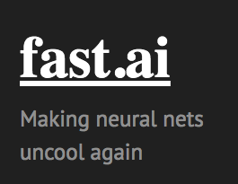

## Summary

Plain and simple, the best deep learning course on the Internet. Jeremy Howard has found a way to make State Of The Art (SOTA) deep learning accessible. If you want to truly understand how convolutional neural networks and recommendation engines work, take this course. He provides the best explanations I've found on both subjects. Before this, I wasn't a Pytorch user. Now there's no reason not to be one.

## Pros

Every lesson is jampacked with information I wanted to know. From beginning to end, I was hooked. Can't say that for many courses. Pytorch is a great framework and the way he mixes up high level abstractions and lower-level neural network construction is phenomenal. His top-down teaching approach makes learning significantly more enjoyable. From the very beginning, students are working with state of the art deep learning models. Then he digs down deeper into the mechanics of each concept using the products students have already built. Afterwards, he often builds them all the way back up from scratch. This methodology has the benefit of providing tangible, working products right from the start. The student is never in question about "why" they're learning a given topic. On top of that, the course flow helps the learners build the appropriate context needed to understand the more difficult concepts that come further down the road. It's clear that this is intentional on the instructor's part. Simply excellent.

## Cons

The videos are long. I watched them at 1.5X speed, but still. 2 hour videos take time. Especially when you're coding along with the videos. Jeremy also spends time answering questions that I'm not interested in hearing answers to.  Otherwise, don't have much to add on the negative side.

