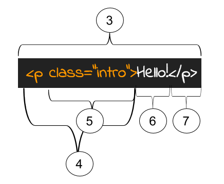

This walkthrough should cover only the most foundational concepts in HTML and CSS. The purpose is not to make you a complete and total expert, but to bring you up to speed with the essential components necessary to start building a website from scratch.

## How to Build a Webpage Walkthrough

The sequence is as follows:
* Part 1 - How HTML Works
* Part 2 - CSS and HTML Attributes
* Part 3 - Composing a Skeleton Website

## Part 1 - How HTML Works

**Tags and Elements**: When building an HTML webpage, the first thing to know is that the page is constructed entirely of HTML elements. Each element starts with a opening tag and ends with a closing tag. For example, if we wanted to create header text like the one at the top of this document, we would begin with the opening tag `<h1>` and end with a closing tag `</h1>`. As you might be able to tell, the difference between an opening and closing tag is that the closing tag has a forward slash ( / ) at the beginning of the tag. If we wanted to create paragraph text, we would use the `<p>` opening tag and the `</p>` closing tag. The text we put in between those tags is known as the content and is what appears on the page.



**Nesting Elements**: A big part of HTML is that we can place some elements inside of other elements. This is known as nesting. When we create a web page, we’ll nest elements inside of each other all the time. That will look like the code below. We call the tags on the outside the parent and the tags on the inside the child. We often use `<div></div>` tags as parent elements. Div elements are short for divider elements, and they section off different parts of the page.

```html
<div>
   <p>
     This content is inside of the child tag, which is inside of the parent tag. Keep an eye on indentation to see which is the parent and which is the child!
   </p>
 </div>
```

**Building a Skeleton Webpage**: When we start building a complete HTML webpage, we’ll need to use certain elements that let our browser know how to create and style the page.  First, we indicate that we’ll be building an HTML document by placing this tag: `<!DOCTYPE html>` at the beginning of the page. Next, we’ll use an `<html></html>` element that will surround all the code on our page. Inside the opening and closing html tags, we’ll place two other important elements: `<head></head>` and `<body></body>`. The head tags hold all the code that goes on behind the scenes of our website. The body tag holds all the code that actually appears on our webpage. Every website has a basic layout that looks the same. Here’s how you should start EVERY webpage:

```html
<!DOCTYPE html>
<html>
   <head>
     <title>My Shiny New Website</title>
   </head>
   <body>
   </body>
</html>
```

After you place those tags inside your html document, you can start placing elements inside of the body to make content appear on the page.

### Let's summarize how HTML works:

* HTML elements are composed of opening and closing tags with content in between them. We can nest HTML elements inside of each other to create
* `<!DOCTYPE html>` - This tag tells your browser that the rest of text that is about to follow is apart of an HTML document. If you leave it out, some browsers won't 'know' what type of document they are looking at (computers are dumb), and the page will break. It's a little boring, but you should have it.
* `<html>` - The most basic HTML tags are simply `<html>` and `</html>`, and all the content of your pages will be written inside these tags.
* `<head>` - The `<head>` contains information about your website, but not actual content that will show up on the page (think of it as the 'brains' of your webpage.) It will contain things like links to stylesheets and code that will make your page beautiful and interactive.
* The `<body>` contains all the content of your page that will actually show up on the screen. 90% of the HTML you write will go inside the `<body>`.

## Part 2 - Introducing Attributes and CSS

**Common Elements**: There are a number of HTML elements that we use pretty frequently on any webpage. Here are a few common elements and the things they create.

* **Paragraph Text**:       `<p>Hello!</p>`
* **Biggest Heading Text**: `<h1>Biggest Header</h1>`
* **Middle Heading Text**:  `<h3>Medium Sized Header</h3>`
* **Small Heading Text**:   `<h6>Smallest Header</h6>`
* **Links:**                `<a href="www.google.com">Link to Google</a>`
* **Images**                ``
* **Horizontal Rule**:      `<hr />`
* **Divider**               `<div> This element sections off part of the page </div>`
* **Ordered Lists**:        `<ol> </ol>`
* **Unordered Lists**:      `<ul> </ul>`
* **List Items**:           `<li>A list item goes inside a list</li>`

You’ll notice that some of these elements have information inside of the tags. These are called **attributes**, and provide extra information to the element, like where a photo is, or where a link should direct users to. To give an element an attribute, place the name of the attribute inside the opening tag followed by an equal sign and the data needed inside quotations like so:


We’ll use attributes often to style elements and inside of images and links.

**Linking with Tags**: To create a link to another website or page in your project, use the anchor `<a>` tag. Surround whatever content you want to link with an opening and closing `<a>` tag. The `<a>` tag includes the attribute href, which points to the address that the link will send users to. For example:

```html
<a href="www.google.com">
  <h2> Click here for my favorite search engine </h2>
</a>
```

Be aware that you can also link to parts of the webpage using IDs, which we’ll cover next.

**Adding Images**: Without any images, your website will be pretty boring. Let's add in an image or two. Use the `` tag (which doesn't need a closing tag) to add an image to your site. The src attribute links to the location of the image (either online or in your project directory).

```html
  
```

**Styling Elements with CSS**: CSS (which stands for cascading style sheets) is the fundamental way of adding style to your websites. Without it, your sites are just a bunch of text in ugly chunks. All the color, style, and generally cool things you see on the web require tons of CSS. Let’s see how that works.

CSS is written using rules. Each rule is composed of a selector, properties, and values. For example, we can select all h1 elements and set their background color to blue. The h1 is the selector, background-color is the property, and blue is the value.


There are many CSS properties to manipulate, such as height, width, font-size, font-family, color, text-align, border, margin, padding, display, position, and many others. Look a few up!

**Using Classes and IDs to Select Elements**: Using selectors like h1 and p will select every `<h1>` and `<p>` on the page. While this is useful, sometimes we need to be more specific. What if I want to select only one `<p>` element, or style a few (but not all) of the images on my page in a specific way. We can use classes and ids to make this happen.

Classes and ids are types of attributes that we can add onto an element in order to be more specific with our CSS selectors. This is what they look like:

```html
<p class="animal-description">

<h1 id="main-title">
```

Classes and IDs allow us to more finely select elements to style using CSS. If we have 10 `<p>` elements on our page, but only want to change the background color of a few of them, we'd reference their class instead of the tag type. If you wanted to only style the `<h1>` on your page that is the main title, while leaving all other `<h1>` elements alone, we'd reference the id we've given it.

We reference a class by using a . (period) and the class name:

```css
.animal-description {
  background-color: #FF0000;
}
```

We reference an id by using a # (hashtag) and the id name:

```css
#main-title {
  background-color: #FF0000;
}
```

**The Magical `<div>` Element**: Open up the source file for any website and you'll see the `<div>` element scattered around all over the place. It's one of the most widely used tags on the web. But what is a div? Divs are boxes or containers that hold HTML elements.

Let's say we have the following HTML elements, and we want to give them all a single blue background color, and want all of the elements to be centered in the page.

```html

<h2>Francis Crick</h2>
<p>Nobel Prize winner and co-discoverer of the double-helix structure of DNA</p>
```

We could work on individually styling each of these elements, but this gets old very fast. Instead, we can put all of these elements inside of a `<div>` and then apply styling to the div itself (Remember that the 'C' in CSS stands for Cascading - meaning that styling to a parent element will cascade down to its children)

```html
<div class="scientist">
  
  <h2>James Watson</h2>
  <p>Nobel Prize winner and co-discoverer of the double-helix structure of DNA</p>
</div>
```

We can now style this div by referencing the id or class that we've given it (in this case it's a class):

```css
.scientist {
  text-align: center;
  background-color: lightblue;
}
```

You should use `<div>` elements whenever you want to create a "group" of elements that receive the same styling and layout (more on layout later).

For lists, use `<ul>` and `<ol>`. There are unordered lists and ordered lists. They work like this:

```html
<ul>
  <li>First List Item</li>
  <li>Second List Item</li>
  <li>Third List Item</li>  
</ul>

<ol>
  <li>First List Item</li>
  <li>Second List Item</li>
  <li>Third List Item</li>   
</ol>
```

Whew! That was a lot. I think we’re finally ready to build our own web page.

## Part 3 - Build a Website from Scratch

**Getting Something On The Page** - Open https://www.codepen.io. Create a new pen and place the following code into the HTML section:

```html
<!DOCTYPE html>
<html>
   <head>
     <title>My Very Own Website</title>
   </head>
   <body>
   </body>
</html>
```

**Structuring the Body**:Nest three divs inside the body tags. Give the first div an id of navbar, give the second div an id of main, and give the third div an id of footer. Notice how even though we have a bunch of HTML tags on the page, we don’t see anything appearing. Divs by themselves don’t provide any content. We’ll have to insert a few other tags to see something displayed.

[FreeCodeCamp](https://www.freecodecamp.com) prescribes a few culminating projects when students have completed the 300 hours of HTML and CSS challenges. One of them is to build a personal portfolio webpage. In this tutorial, we’ll roughly follow the guidelines they’ve outlined for us [here](https://learn.freecodecamp.org/responsive-web-design/responsive-web-design-projects/build-a-personal-portfolio-webpage/).

First, we’ll add content to the navbar. Start off by nesting an h1 element inside the navbar and put your name as the content. Next place 3 anchor tags inside the navbar that each reference an id for different sections of the page. Give the links whatever name you choose.

Now we should see something on the page! It doesn’t look good, but it’s there.

Feel free to start adding style to your navbar, h1, and a elements as well. Give your navbar a width of 100% and a background color. Give your h1 and a elements a color as well.

Next, nest 3 divs inside the div with an id of main. Give the first div the id of “welcome”, the second div the id of “portfolio”, and the third div the id of “contact”. You’ll probably want to add some CSS for the height and width of each section as well.

In the welcome section, create an image tag and link it to any image that represents you best - either a picture of you, or something you love. Style that image in whatever fashion you desire.

---

Great! Now you’re ready to build yourself a portfolio page. Most likely, you're going to want to add some additional styling to make it look nice. In the next walkthrough, we'll discuss designing our website and improving our CSS skills.

## Resources and Extras

Want a more comprehensive overview of HTML and CSS? Want to expand your skills and practice what you've learned? Check out a few of these additional resources to get you going:

* [HTMLDOG](https://www.htmldog.com/guides/html/beginner/) - HTML Beginner Tutorial to show you the ropes of HTML.
* [Learn HTML & CSS](https://learn.shayhowe.com/html-css/) - Amazing tutorial series from Shay Howe on all the ins and outs of web development. Couldn't recommend this online book enough. Use it as a reference when going through other tutorial series.
* [FreeCodeCamp](https://www.freecodecamp.com) - Online platform with 300 hours of guided front-end web development challenges that help you master HTML and CSS in its entirety.
* [Khan Academy](https://www.khanacademy.com) - Khan academy has added a number of computer programming and computer science courses that are very structured and well lead. This is perfect for beginners and intermediate students alike.
* [Codecademy](https://www.codecademy.com) - Online platform that offers a number of free solid courses in web design and other disciplines
* [Quizlet HTMl & CSS Flash Cards](https://quizlet.com/5807800/csshtml-flash-cards/) - Set of flash cards on the basics of HTML, CSS, and the Internet. Used for an Intro to Web Design class.
