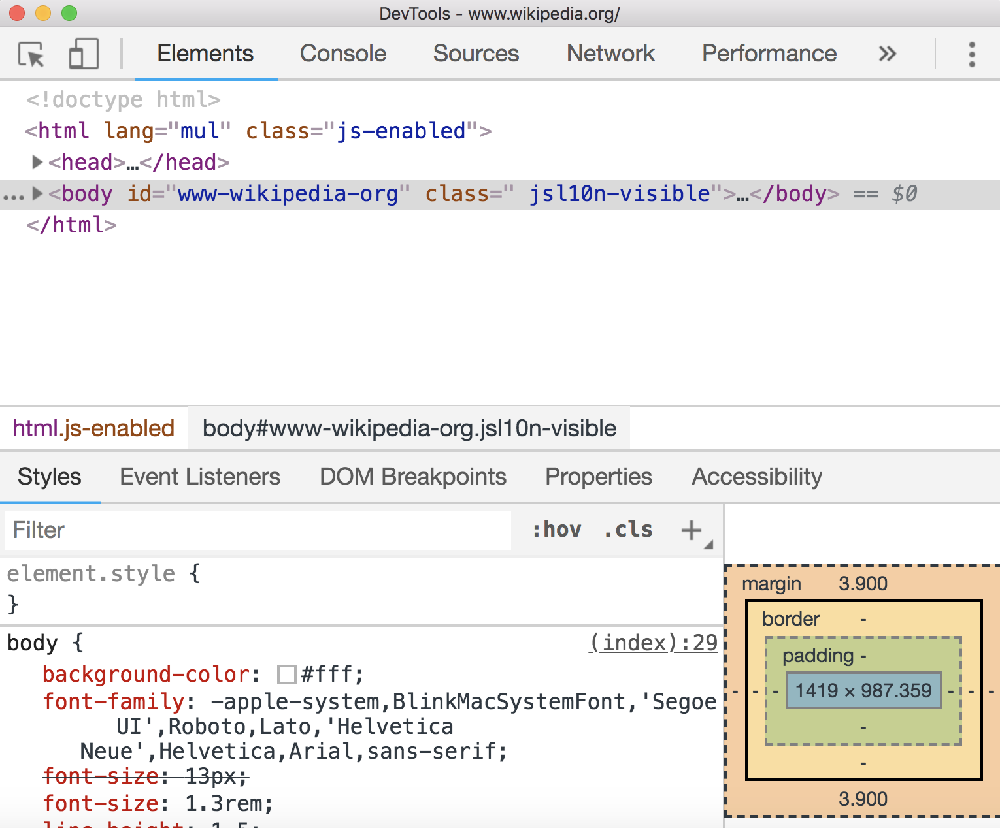
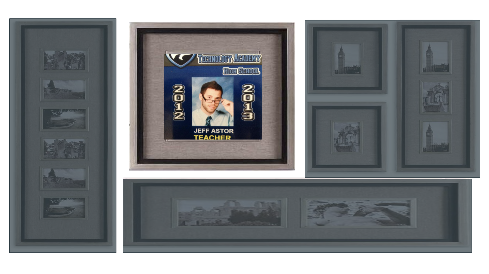
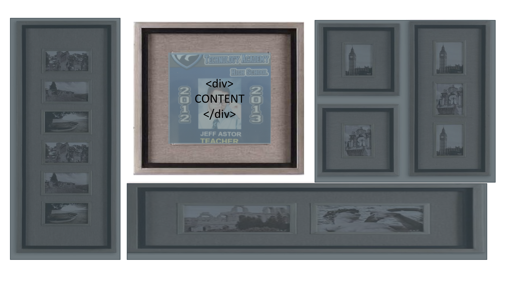
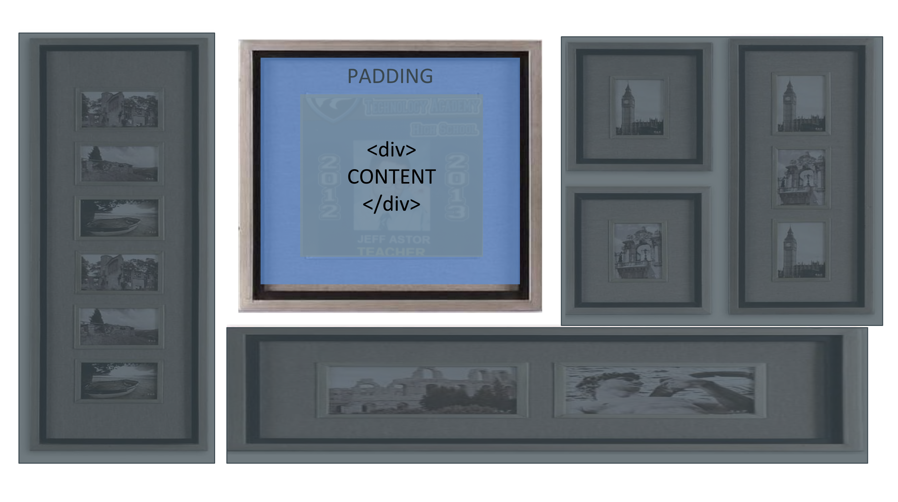
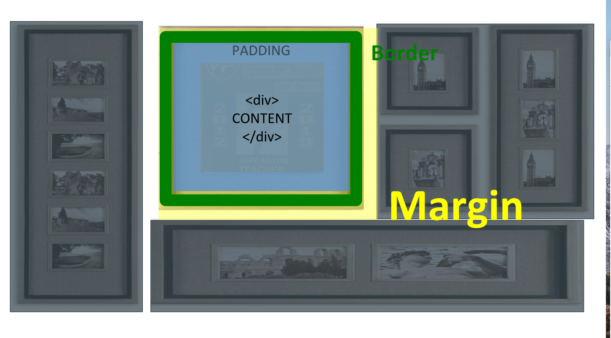

In the previous walkthrough, we focused on how to use HTML and CSS to get our content onto our website. This post will cover how to position elements on a page. By understanding the box model and CSS positioning, web developers can design visually appealing sites.

Here's how they both work.

## The Box Model

The first thing you should know is that every single element on an HTML page actually exists inside of a rectangular box. Every image, header, paragraph, div, video - everything. But don't take my word for it. Go to your favorite website and open up the developer tools (inspect element using Google chrome on a macbook).

Open up [Wikipedia.com](http://www.wikipedia.com) and then inspect element on the page.



Inside the two head tags, there should be a style tag that looks like this `<style>...</style>`. Open those tags in and insert the following code before everything else inside the style tags.

```css
*, *:before, *:after {
    border: 1px solid red;
}
```

We've just added a solid red border to every element on the page using the * wildcard selector.


Notice how everything on the page is surrounded by rectangles? There's even rectangles *inside* of other rectangles. **Rectangleception**.

This is the perfect way to get started with the box model.

## So, what is the Box Model?

The box model is the way we think about how to position HTML elements on a page using CSS. Every element lives inside its own box, and we can change the properties of the box to move elements around on a page.

One way to think of the box model is to imagine each element as a picture frame.  


Let's zoom in on the picture of me and use this frame as an example. What similarities do each of these picture frames share?

+ Well, each frame has content - in this case, the picture itself. The image also has a certain  **width** and **height**.

+ Moving outward, we next have that white space, which we call **padding**.

+ After the padding, we hit the picture frame itself. In CSS we call this the **border**.

+ Last, we have the space beyond the frame that distances it from the other frames on the wall - this is the **margin**.


As you'll learn shortly, we can move elements around on a page by modifying height, width, margin, border, and padding.


## Designing The Layout of Our website

We were able to create a nice navbar in the previous post, but we couldn't get rid of that pesky whitespace on the outside of it.

This is due to the fact that the `<body></body>` of every website starts off with a little bit of margin.

Load up your codepen.io personal portfolio project and place this code into the CSS section.

```css
body {
  margin: 0;
}
```

Notice what just happened? We'll use margin frequently as we design this site, so stay on your toes.

## CSS Display and Position Properties

### The Display Property

In CSS, elements can either display **block**, **inline**, or **inline-block**. To any newbie, this won't mean anything. That's fine. Just remember this simplified version of how they work:

> Block elements take up the entire row they are on and inline elements do not.

That means inline elements can all live in the same line - they stack from left to right. Block elements do not.

Inline-block elements have characteristics of block elements but can stack left to right.

Still sound kind of confusing?

The best way to understand the display property is to see examples of it being used.

Let's look at a few inline elements and a few block elements:
* **Inline elements**: img, a, span, br, em, strong
* **Block elements**: p, h1, ul, li, almost everything else

<br />

```css
.stack-left-to-right {
  display: inline-block;
}

#big-image {
  display: block;
}
```

### The CSS Position Property

Many of my students who are new to web development overuse `position: absolute` to move elements around on the page. While this strategy *does* work, it's usually not the right long-term solution.

Using the `position: absolute` in CSS removes HTML elements from the normal flow of the page. As stated by [MDN](https://developer.mozilla.org/en-US/docs/Web/CSS/position):

> **absolute** - The element is removed from the normal document flow, and no space is created for the element in the page layout. It is positioned relative to its closest positioned ancestor, if any; otherwise, it is placed relative to the initial containing block. Its final position is determined by the values of top, right, bottom, and left.

That means that other elements will behave as if it were not there. While this might be ideal behavior for a few use cases, a good rule of thumb to follow is to K.I.S.S. Keep It Stupid Simple (It's actually "Keep It Simple, Stupid" but that sounds meaner). Don't overcomplicate things for no reason. Most of the time you'll want elements to keep their default value, static.

Here's what MDN has to say:

> **static** - The element is positioned according to the normal flow of the document. The top, right, bottom, left, and z-index properties have no effect. This is the default value.

This is how elements appear on the page by default. You should only change this value for certain cases. Good examples include things like a sticky navbar (a navbar that stays at the top of the page as you scroll down), or a modal (a popup that takes up the whole screen).

Here are the other two display property options for reference and what MDN has to say about them:

* **relative**: The element is positioned according to the normal flow of the document, and then offset relative to itself based on the values of `top`, `right`, `bottom`, and `left`. The offset does not affect the position of any other elements; thus, the space given for the element in the page layout is the same as if position were `static`.
* **fixed**: The element is removed from the normal document flow, and no space is created for the element in the page layout. It is positioned relative to the initial containing block established by the `viewport`... Its final position is determined by the values of `top`, `right`, `bottom`, and `left`.

You specify the position of your element via offset properties: auto (default), top, bottom, right, left.

```css
.sticky-navbar {
  position: fixed;
  width: 100%;
  left: 0;
  top: 0;
  height: 75px;
  background: dodgerblue;
  color: white;
  box-shadow: 0 2px 4px 0 rgba(153,153,153,.75);
}
```

An element whose position property is set to absolute or fixed is called an absolutely positioned element.

## Learn Layout
To learn about different ways of laying out content, head to [Learn Layout](http://learnlayout.com/) and walk through their lessons.

## Resources

+ [KhanAcademy - CSS Layout](https://www.khanacademy.org/computing/computer-programming/html-css#css-layout-properties)
+ [CodeAcademy - CSS Positioning](https://www.codecademy.com/courses/web-beginner-en-6merh/0/1#)
+ [FreeCodeCamp - Introduction to Basic CSS](https://learn.freecodecamp.org/responsive-web-design/basic-css)
+ [Learn Layout](http://learnlayout.com/)
+ [CSS Tricks - The Box Model](https://css-tricks.com/the-css-box-model/)
+ [Shay Howe on the Box Model](http://learn.shayhowe.com/html-css/opening-the-box-model/)
