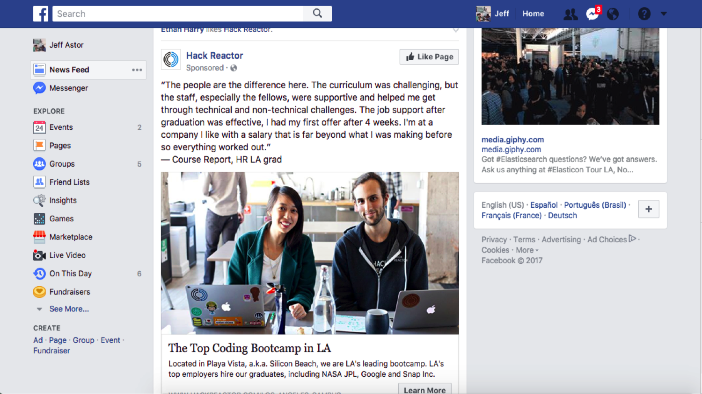

In the previous post, we covered the CSS display and position properties - each of which helps give HTML elements a certain behavior in our website layout. This time, we'll cover one of the newest developments in modern CSS: flexbox. Flexbox is extremely powerful and solves many of the problems that web developers have struggled with before 2019.

We won't cover how to do everything in flexbox - there are other articles that do this better. Instead, we'll focus on constructing a flexbox-based layout that is used across a number of high quality websites.

Let's get started.

## CSS Flexbox

When I first learned how to design websites, I was taught to use CSS floats. Though floating elements on a page definitely works, it always felt hacky.

Also, I can't lie - I sucked at them. Pretty much any time I worked with CSS I dreaded dealing with floats.

<figure> 
  
  <figcaption style="text-align:center">Stolen from r/ProgrammerHumor</figcaption>
  <br />  
</figure>

Fortunately, we now have flexbox and it's available on almost every modern browser. Check  [here](http://caniuse.com/#feat=flexbox) to make sure I'm right.

## Introduction to Flexbox

Instead of going over each flexbox rule individually, we're going to look at the layout we created in previous posts and see how flexbox can enhance our page. our lives easier.

Let's start with a simple website.

<iframe height="365" style="width: 100%;" scrolling="no" title="Flexbox Layout Part I" src="//codepen.io/jastor11-the-decoder/embed/NJjZZj/?height=265&theme-id=light&default-tab=result" frameborder="no" allowtransparency="true" allowfullscreen="true">
  See the Pen <a href='https://codepen.io/jastor11-the-decoder/pen/NJjZZj/'>Flexbox Layout Part I</a> by Jeff Astor
  (<a href='https://codepen.io/jastor11-the-decoder'>@jastor11-the-decoder</a>) on <a href='https://codepen.io'>CodePen</a>.
</iframe>

This is all code we've seen before. The h1 element displays block, so it takes up the entire row it lives on. That means the `<ul>` is pushed to the next row. Each of the `<li>` behaves in the same way.

Now, this doesn't look horrible, but it's also not ideal. Let's use flexbox to style this navbar a bit. I'm going to write some code first, and then explain what it does.

First change the CSS code for your navbar by adding `display: flex` on line 7.

```css{numberLines: true}
.navbar {
  background: rgb(40,50,60);
  color: white;
  font-family: Courier New;
  padding: 0 20px;
  height: 110px;
  display: flex;
}
```

Notice how everything now fits onto a single line? By telling the `.navbar` to display flex, we turn it into a flex container. Flex containers place all child elements onto the same row by default.

Next add the `display: flex` property to the `<ul>` as well. Now, all the `<li>` elements should live on the same row as well. Lovely.

## Justify-Content and Align-Items

We're now ready to tell our navbar and ul where their child elements should be aligned.

First, we'll need to understand the two axes that flexbox operates on. They are:
+ main axis
+ cross axis

<figure>
  
  <figcaption style="text-align:center">Found on CSS tricks <a href="https://css-tricks.com/snippets/css/a-guide-to-flexbox/">here</a></figcaption>
  <br />  
</figure>

The main axis points in the same direction that each element is laid out. So for our navbar, all elements get laid out from left to right. That is our **main axis**. Which means that our **cross axis** is running top to bottom.

The justify-content property positions elements along the main axis and the align-items property positions elements on the cross axis.

For starters, we'll tell the navbar to `justify-content: space-between` and `align-items: center`. We'll also change the height of the navbar to 70px, as we no longer need as much space on the top and bottom.

```css{numberLines: true}
.navbar {
  background: rgb(40,50,60);
  color: white;
  font-family: Courier New;
  padding: 0 20px;
  height: 70px;
  display: flex;
  justify-content: space-between;
  align-items: center;
}
```

Justifying our content as `space-between` maximizes the space between whatever elements are inside our flex container. That moves the ul as far away from the h1 as is possible from left to right. Remember that justify-content works on the main axis. Looks nice right?

Aligning items in the center makes sure that they are directly in the center of the top and bottom of our navbar. This works on the cross-axis, or the axis perpendicular to the direction that elements are laid out in.

For both of these properties, we can choose  `flex-start`, `flex-end`, `space-between`, `space-around`, `space-evenly`, or `stretch`. Try a few of them out to get a feel for how they work.

Let's also add a little space to our list items like so:

```css
ul li {
  margin-right: 30px;
}
```

 And then our navbar should look like the codepen below. Not bad for only 20 lines of CSS.

 <iframe height="565" style="width: 100%;" scrolling="no" title="Flexbox Layout Part II" src="//codepen.io/jastor11-the-decoder/embed/gERagN/?height=565&theme-id=light&default-tab=result" frameborder="no" allowtransparency="true" allowfullscreen="true">
  See the Pen <a href='https://codepen.io/jastor11-the-decoder/pen/gERagN/'>Flexbox Layout Part II</a> by Jeff Astor
  (<a href='https://codepen.io/jastor11-the-decoder'>@jastor11-the-decoder</a>) on <a href='https://codepen.io'>CodePen</a>.
</iframe>

## The Holy Grail Layout

One of the most classic designs in website development is known as the Holy Grail. It involves a navbar, 3 columns, and a footer. Facebook does a variation on the standard Holy Grail layout, as they leave out a prominent footer.

<figure>
  
  <figcaption><em>Ignore my facebook feed please.</em></figcaption>
  <br />  
</figure>

We'll go ahead and recreate this layout using flexbox. First add the following html below the navbar:

```html
<main>
  <div class="col first"></div>
  <div class="col second"></div>
  <div class="col third"></div>
</main>
```

We'll then go ahead and add the appropriate CSS to make our main element a flex container. We'll also add some background color to our columns to visualize them better. Just like before:

```css
main {
  display: flex;
}
.col {
  min-height: 100vh;
  font-family: Courier New;
  padding: 1em;
}
.first {
  background: rgb(40, 50, 60);
}
.second {
  background: rgb(210, 220, 240);
}
.third {
  background: rgb(40,50, 60);
}
```

However, when we do this, notice how nothing shows up? Without any content, there's nothing telling our columns how much space to take up. We could specify a particular width, but let's use flexbox instead.

Add this one line to the col class and watch what happens.

```css
.col {
  min-height: 100vh;
  font-family: Courier New;  
  padding: 1em;
  flex: 1;
}
```

<br />

<iframe height="565" style="width: 100%;" scrolling="no" title="Flexbox Layout Part IIIa" src="//codepen.io/jastor11-the-decoder/embed/pYwyaz/?height=565&theme-id=light&default-tab=result" frameborder="no" allowtransparency="true" allowfullscreen="true">
  See the Pen <a href='https://codepen.io/jastor11-the-decoder/pen/pYwyaz/'>Flexbox Layout Part IIIa</a> by Jeff Astor
  (<a href='https://codepen.io/jastor11-the-decoder'>@jastor11-the-decoder</a>) on <a href='https://codepen.io'>CodePen</a>.
</iframe>

Interesting. The flex property combines three different properties: flex-grow, flex-shrink, and flex-basis. Each of them controls the space an element occupies.
+ **flex-grow**: A unitless value that dictates the proportion of space an element takes up along the main axis.
+ **flex-shrink**: A value that determines how much of the element to take away when they are overflowing their container.
+ **flex-basis**: The minimum value an element can shrink down to.

By indicating `flex: 1`, we've only used the flex-grow property. Giving each column a value of 1 makes sure that each one takes up 1/3 of the space along the main axis (3 columns each with a flex of 1).

Let's change the middle column to have a flex of 2.2.

```css
.second {
  background: rgb(210, 220, 240);
  flex: 2.2;
}
```

You should see something like this:

<iframe height="565" style="width: 100%;" scrolling="no" title="Flexbox Layout Part IIIb" src="//codepen.io/jastor11-the-decoder/embed/ywXJpb/?height=565&theme-id=light&default-tab=result" frameborder="no" allowtransparency="true" allowfullscreen="true">
  See the Pen <a href='https://codepen.io/jastor11-the-decoder/pen/ywXJpb/'>Flexbox Layout Part IIIb</a> by Jeff Astor
  (<a href='https://codepen.io/jastor11-the-decoder'>@jastor11-the-decoder</a>) on <a href='https://codepen.io'>CodePen</a>.
</iframe>

Play around with those flex values until you get column widths you like best.

## Adding Content

We'll wrap this up by adding some content to our middle column. A Facebook-like feed would be a nice final piece, so let's add an `<h2>Feed</h2>` to the second column. Follow that up with an `<hr />`. Next, create a div with a class of feed and nest four divs inside. Give each one a class of "feed-item".

Your second column should look like this:

```html
<div class="col second">
  <h2>Feed</h2>
  <hr />
  <div class="feed">
    <div class="feed-item"></div>
    <div class="feed-item"></div>
    <div class="feed-item"></div>
    <div class="feed-item"></div>          
  </div>
</div>
```

Then, add the following styles to your CSS section.

```css
h2 {
  font-size: 2.5em;
  margin-bottom: 0.5em;
}
.feed {
  display: flex;
}
.feed-item {
  height: 100px;
  flex: 1;
  background: white;
  border-bottom: solid 1px slategray;
  border-radius: 8px;
  margin: 10px;
}
```

<br />

<iframe height="565" style="width: 100%;" scrolling="no" title="Flexbox Layout Part IIIc" src="//codepen.io/jastor11-the-decoder/embed/XGgKEZ/?height=565&theme-id=light&default-tab=result" frameborder="no" allowtransparency="true" allowfullscreen="true">
  See the Pen <a href='https://codepen.io/jastor11-the-decoder/pen/XGgKEZ/'>Flexbox Layout Part IIIc</a> by Jeff Astor
  (<a href='https://codepen.io/jastor11-the-decoder'>@jastor11-the-decoder</a>) on <a href='https://codepen.io'>CodePen</a>.
</iframe>

And just as expected, all elements line up from left to right - along the main axis. That's not the ideal behavior for a feed though. We'd prefer if they would align themselves on an axis going from top to bottom. With flexbox, that's easy to do. Add one line of CSS to the div with a class of feed for the desired effect.

```css
.feed {
  display: flex;
  flex-direction: column;
}
```

And now we get this:

<iframe height="565" style="width: 100%;" scrolling="no" title="Flexbox Layout Part IIId" src="//codepen.io/jastor11-the-decoder/embed/wOezyr/?height=565&theme-id=light&default-tab=result" frameborder="no" allowtransparency="true" allowfullscreen="true">
  See the Pen <a href='https://codepen.io/jastor11-the-decoder/pen/wOezyr/'>Flexbox Layout Part IIId</a> by Jeff Astor
  (<a href='https://codepen.io/jastor11-the-decoder'>@jastor11-the-decoder</a>) on <a href='https://codepen.io'>CodePen</a>.
</iframe>

## Resources and Wrapping Up

We only looked at a few core pieces of flexbox and there is so much more to learn. Fortunately, there are a number of exhaustive resources that do a great job of covering the rest. In fact, there's two fantastic games that I use to teach my students flexbox every year.

I recommend they follow this sequence:
+ **Flexbox Froggy** - <a target="_blank" href="https://flexboxfroggy.com">Flexbox froggy</a> is a fun game made by the folks at team treehouse that has over 20 interesting level of flexbox challenges.
+ **Flexbox Tower Defense** - <a target="_blank" href="http://www.flexboxdefense.com">Flexbox Tower Defense</a> is another game that teaches flexbox from a slightly different approach. Also a ton of fun.
+ **The Complete CSS Flexbox Tutorial** - https://medium.com/@js_tut/the-complete-css-flex-box-tutorial-d17971950bdc
+ **CSS Tricks - A Guide to Flexbox** - https://css-tricks.com/snippets/css/a-guide-to-flexbox/
+ **FreeCodeCamp** - Complete the code challenges provided by FreeCodeCamp when you feel you understand flexbox more fully. This will help prepare you to actually build things with flexbox.

Start by completing every level from Flexbox Froggy using [MDN](https://developer.mozilla.org/en-US/docs/Learn/CSS/) - Mozilla Developer Network - as a guide. When you're finished, move on to Flexbox Tower Defense and read through the last two articles as a complete reference guide. When you're finished, complete all of the FreeCodeCamp challenges on flexbox.

As always, try and build something yourself and see how flexbox makes your life easier. Good luck!
