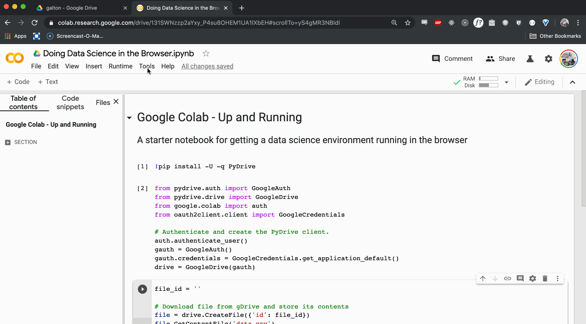
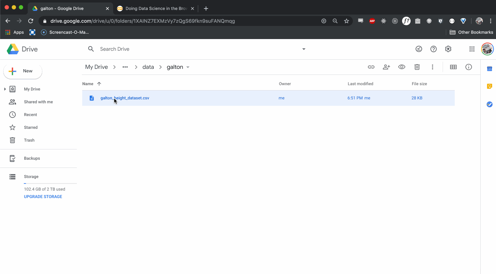

Four years ago when I read my first article on building neural networks from scratch, the author had me installing anaconda, tensorflow, and getting a Jupyter notebook environment running on my laptop. A couple hours later, I was up and running and had a neural network training on my cpu. Besides using every resource my compaq had in it, my homemade multi-layer perceptron took about 12 hours to train. Who knew GPUs would be so useful?

For a high school computer science teacher, the cost of putting together a legit deep learning box was prohibitively high. Lucky for me, in the last half decade the cloud has evolved and adopted data science in its entirety. Now I can spin up a deep learning instance for pennies on the dollar in the Google Cloud or on AWS. 

For simple exploration, exploratory data analysis, and data munging I prefer to do my data science work in the browser. Kaggle kernels come preloaded with hundreds of data sets, most modern data science libraries, and 12 hours of GPU time for free. Google Colab offers the same and syncs up with Google Drive or external APIs for seamless importing of data.

In this post, I'm going to walk through my approach to exploring data in the browser using a Google Colab notebook.

If you want to jump straight into the code, here's a starter <a href="https://colab.research.google.com/drive/131SWNzzp2aYxy_P4su8OHEM1UA1lXbEH" rel="noopener noreferrer" target="_blank">notebook</a> that you can duplicate and get right to it.

Otherwise, just open that notebook and make a new Python 3 notebook to follow along.

## Getting Acquainted with the Environment

If you understand Jupyter Notebooks, then you understand Google Colab. Each cell can either store markdown text or python code, and the code can be run by hitting the play button or holding down shift and pressing enter.

The output of each cell is displayed beneath the code cell, but be aware: all variables created and run in any cell are stored for the duration of the session.

To change the settings, click on Tools > Settings like the following GIF:

<div>
  {/*
<!--  -->
  */}
</div>

<figure>
    
</figure>


## Importing Data

There are a number of ways to get data into Google Colab, but the one I like the best works as follows. First, upload the data to Google drive. Then, we'll install PyDrive, mount the PyDrive client, and download the file into the Google Colab VM. You can install PyDrive like so:

```bash
!pip install -U -q PyDrive 
```

Now that you've installed PyDrive, you can mount the client like so:

```python
# Get the necessary imports 
from pydrive.auth import GoogleAuth
from pydrive.drive import GoogleDrive
from google.colab import auth
from oauth2client.client import GoogleCredentials

# Authenticate and create the PyDrive client.
auth.authenticate_user()
gauth = GoogleAuth()
gauth.credentials = GoogleCredentials.get_application_default()
drive = GoogleDrive(gauth)
```

You'll be asked to follow up with some Google OAuth, which you'll have to do *every* time you run this notebook. It's annoying, but I find it more seamless than uploading the data each time I run the notebook again.

Now finally, we can download the file into the Colab VM. Enter the following code into another cell:

```python 
file_id = ''

# Download file from gDrive and store its contents
file = drive.CreateFile({'id': file_id})
file.GetContentFile('data.csv')
```

Where do we find the `file_id`?

Open up the Google Drive folder that holds the csv file. Preview the file and open it in a new window. Then, file the file_id in the url after the `d/`. The following GIF should offer a better visual explanation.

<div>
  {/*
<!--  -->
  */}
</div>


<figure>
    
</figure>

Store that id in the variable `file_id` and run the cell.

As a sanity check, run the following cell and see the `data.csv` file stored locally.

```bash
!ls
```

If you used the file_id that I've made publically available, you should now have access to the famous Galton Height Dataset of 1886.

For those who might have missed it, the file id is `1YFUaKaUp9CXj_xe3jh00cabEbKT70EcY`.

## Doing Data Science

At this point, we're ready to go. We'll start by importing pandas, numpy and matplotlib, then we'll begin to explore our data.

Create another cell that has the following code:

```python
import pandas as pd 
import numpy as np 
import matplotlib.pyplot as plt 
%matplotlib inline 

plt.style.use('ggplot')
```

Having handled the proper imports, we can read our `data.csv` file into pandas and do a bit of cleaning.

```python
galton = pd.read_csv('data.csv')
print(galton.shape)
galton.head()
```

We see that our DataFrame has 890 rows and 6 columns. Now it's your turn to run some summary statistics. I'll start you off with a few questions. You'll want to answer the each one with only one line of code.

1. Check the data types for each column and if there are any missing values.
2. Check the mean, standard deviation, and quartile information for numerical columns.
3. Determine the relative frequency of boys and girls.

Give it a shot and I'll have the answers for you in the next post.

## Wrapping Up and Resources

That's all you'll need to get started, but your journey into data science has just begun. If you're looking for reference materials, check out the resources below:

+ https://pandas.pydata.org/
+ https://chrisalbon.com/
+ https://colab.research.google.com/notebooks/welcome.ipynb
+ https://research.google.com/colaboratory/faq.html


