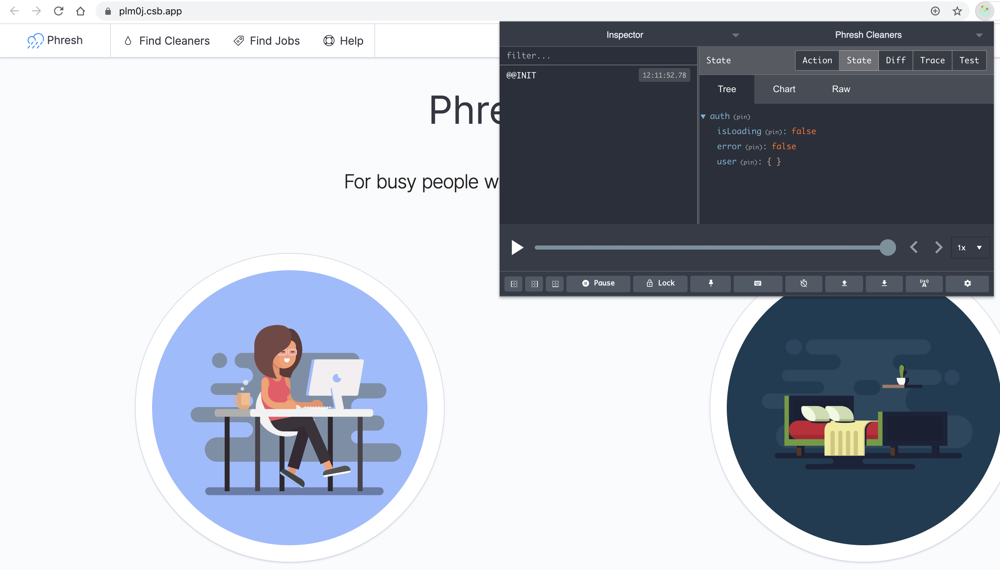
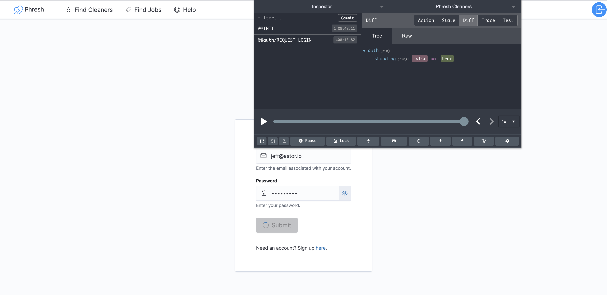

import { FastAPISeriesList, CodesandboxDisplay } from "src/components"

Welcome to Part 15 of Up and Running with FastAPI. If you missed part 14, you can find it [here](/blog/phresh-frontend-bootstrapping-a-react-app).

This series is focused on building a full-stack application with the FastAPI framework. The app allows users to post requests to have their residence cleaned, and other users can select a cleaning project for a given hourly rate.

<FastAPISeriesList upTo={15} />

In the last post, we used `react-router` to implement client-side navigation and built out login and registration pages so that users can sign up and log in to our application.

Right now our forms don't actually submit the user's authentication credentials to our server. In fact, our FastAPI server isn't involved with our frontend at all. We're going to change that in this post. We'll start by setting up `redux` to manage global state for our application, and then we'll use `axios` to make api calls to our server for authentication.

If you've heard scary things about `redux`, don't worry. We'll take it slow and move through each concept gradually.

## The Redux Store

Since [Dan Abramov](https://overreacted.io) introduced [redux](https://redux.js.org) back in 2015, it has received a lot of praise and a lot of criticism. The home page describes `redux` as a predictable state container for javascript applications. That phrase is too vague and presents as more of a marketing soundbite than an actual description.

Redux is a pattern that makes managing global state easy to reason about. The library itself weighs in at less than 7kb and the `react-redux` bindings add another ~14kb. 

So it's less about the code than it is about the mental model. 

Though, trust me, we'll write a lot of `redux` code. That's developers main gripe with `redux`: too much boilerplate. I understand the sentiment, but feel the benefits *far* outweight the costs.

A good way to understand `redux` is to build a mini version from scratch. Since the library itself is so small, we'll do that here in <100 LOC.

Let's get to the code.

At it's core, `redux` consists of a single source of truth - the **store** - that holds our global state tree. In a standard app, we'd use the `createStore` function imported directly `redux` to set that up. 

Here's a **very** abbreviated version of what that function does.

```js
function createStore(initialState = {}) {
  let stateTree = initialState

  function getState() {
      return stateTree
  }

  return { getState }
}

// example usage
const store = createStore()
const stateTree = store.getState()

```

So the store is simply an object with a `getState` method. Calling `getState` returns the state tree object that is captured by a [closure](https://developer.mozilla.org/en-US/docs/Web/JavaScript/Closures). 

That seems simple enough, right. Observant readers have probably noticed that if that were all there is to it, there'd be no way to change the state tree. It's important to know that this is by design. In `redux` we **never** mutate the state tree. Instead, we use **actions** and **reducers** to create a new state tree each time we need to change something.

Don't get tripped up by the lingo. Seeing examples helps make things more clear.

An action is just an object that dictates what change to our state tree needs to occur. 

For example, if we were building a music player app and a user clicks on their favorite song, our code would **dispatch** an action that looks like this:

```js
const action = {
  type: "CHANGE_SONG",
  song: {
    id: 3,
    title: "Hips Don't Lie",
    artist: "Shakira"
  }
}

```

Every action must include a `type` property with a unique value identifying the action. Anything else included in the action is additional relevant data, but is not required. The `type` property is.

What does it mean to **dispatch** an action? Well, that's actually the name of the next method on the redux store.

```js
function createStore(initialState = {}) {
  let stateTree = initialState

  function getState() {
      return stateTree
  }

  function dispatch(action) {
    // figure out how to use the action to create a new state tree here

    return action
  }

  return { getState, dispatch }
}

// example usage
const store = createStore()
const stateTree = store.getState()

store.dispatch({
  type: "CHANGE_SONG",
  song: {
    id: 3,
    title: "Hips Don't Lie",
    artist: "Shakira"
  }
})

const newStateTree = store.getState()

```

We want our `dispatch` method to figure out how to create a new state tree based on the action it was provided. That's where our **reducers** come in. A reducer is a *pure* function that returns a new state tree using the dispatched action and the current state tree.

Here's an example:

```js
function songReducer(state = {}, action) {
  switch(action.type) {
    case "CHANGE_SONG":
      return {
        ...state,
        currentSong: action.song,
        isPlaying: true,
      }
    case "PAUSE_SONG":
      return {
        ...state,
        isPlaying: false,
      }
    case "PLAY_SONG":
      return {
        ...state,
        isPlaying: true,
      }
    default:
      return state
  }
}

```

This `songReducer` function takes in the current state and an action and uses a `switch` statement to return a new object if the `action.type` matches any of the defined cases. 

So what does it mean for a function to be *pure*? 

It means that the function simply takes input and returns output. It never modifies its arguments or anything else outside the scope of the function. If it needs to change an argument, it just returns a new value. A good rule of thumb is that a pure function should always return the same value when provided a particular input.

The consequence of writing pure reducer functions is that we never mutate the store. Instead, our actions describe how the new state tree should look and our reducer makes that happen by copying parts that don't change (all that `...state`), and adding new values for what should be updated.

Let's modify our `createStore` function to use the new songReducer function we just wrote.


```js
import songReducer from "./songs" // highlight-line

function createStore(initialState = {}, reducer) {  // highlight-line
  let stateTree = initialState
  let currentReducer = reducer // highlight-line

  function getState() {
      return stateTree
  }

  function dispatch(action) {
    const newStateTree = currentReducer(stateTree, action)  // highlight-line

    return action
  }

  return { getState, dispatch }
}

// example usage
const store = createStore({}, songReducer)
const stateTree = store.getState()

```

Each time we dispatch an action, our store passes the current state and the action to our `songReducer`. It then replaces the current state tree with the result of calling the reducer, before returning the action. 

Put together, they create a data flow that looks like this:

<video autoplay loop muted playsinline>
  <source src="./redux-data-flow.webm" type="video/webm" />
  <source src="./redux-data-flow.mp4" type="video/mp4" />
</video>

The reducer **must** return a new object each time it's called, because that's what redux uses to check if anything in the state tree has changed. So make sure that every reducer function is **pure**.

### Sidetrack - Pure Functions

It's important to understand the difference between a pure function and a function that has *side effects*, or mutations.

Here's an example related to the fake music player app:

```js
const playlist = {
  title: "Shakira workout tunes",
  songs: ["Hips Don't Lie", "She Wolf", "Chantaje"],
  totalMinutes: 9.45,
}

const song = { title: "Waka Waka", minutes: 3.10 }

export default function addSongMutate(playlist, song) {
  playlist.songs.push(song.title)
  playllist.totalMinutes += song.minutes
  return playlist
}

export default function addSongPure(playlist, song) {
  return {
    ...playlist,
    songs: [...playlist.songs, song.title],
    totalMinutes: playlist.totalMinutes + song.minutes
  }
}
```

The `addSongMutate` function manipulates the `playlist` object itself, while the `addSongPure` returns a brand new `playlist` object without making any changes to the original. It simply copied the parts of the playlist it wanted to keep and then made whatever updates were necessary. The ES6 `...` Spread Operator makes copying objects and arrays easy and concise.

If we were to call `addSongMutate` with the `playlist` and `song` arguments multiple times, we'd get a different result on each subsequent execution. On the other hand, calling the `addSongPure` function with the `playlist` and `song` arguments would return the same result every time.

### Back to Redux

Now, why are pure functions a good thing? Well, because our reducer functions are pure and our actions are just objects describing changes to the state tree, we can easily track what action lead to what change in our data. In fact, if we want to know when/how our state tree updated, we can replay each change to our state tree action by action. It's called **time-travel debugging**.

> There's even a devtools extension for [chrome](https://chrome.google.com/webstore/detail/redux-devtools/lmhkpmbekcpmknklioeibfkpmmfibljd?hl=en) and [firefox](https://addons.mozilla.org/en-US/firefox/addon/reduxdevtools/) that allows us to see all of this in one place. It's **highly** recommended to download this extension as we'll use it extensively.

In essence, the pattern introduced here **makes changes to the state tree predictable**, which is where the tagline we saw on the `redux` homepage comes from.

Alright, we're almost done here. The last method we need to add to the store provides the ability to listen to changes in the state tree.


```js
function createStore(initialState = {}, reducer) {
  let stateTree = initialState
  let currentReducer = reducer
  let listeners = [] // highlight-line

  function getState() {
      return stateTree
  }

  function dispatch(action) {
    stateTree = currentReducer(stateTree, action)
    listeners.forEach(listener => listener())  // highlight-line

    return action
  }

  // highlight-start
  function subscribe(newListener) {
    listeners.push(newListener)

    return function unsubscribe() {
      const index = listeners.indexOf(listener)
      listeners.splice(index, 1)
    }
  }
  // highlight-end

  return { getState, dispatch, subscribe }
}

```

This `subscribe` method is the primary way components will gain access to changes in our state tree. We wouldn't want to have to call `getState` all the time just to see if something changed. Instead, the store keeps track of all listener callbacks internally and calls them whenever an action is dispatched. We also return an `unsubscribe` function in our `subscribe` method to allow consumers to stop listening at any point.

And that's everything in a nutshell! Let's put it all together in one place to see what we just did.

```js
function createStore(initialState = {}, reducer) {
  let stateTree = initialState
  let currentReducer = reducer
  let listeners = []

  function getState() {
      return stateTree
  }

  function dispatch(action) {
    stateTree = currentReducer(stateTree, action)
    listeners.forEach(listener => listener())

    return action
  }

  function subscribe(newListener) {
    listeners.push(newListener)

    return function unsubscribe() {
      const index = listeners.indexOf(listener)
      listeners.splice(index, 1)
    }
  }

  return { getState, dispatch, subscribe }
}

function songReducer(state = {}, action) {
  switch(action.type) {
    case "CHANGE_SONG":
      return {
        ...state,
        currentSong: action.song,
        isPlaying: true,
      }
    case "PAUSE_SONG":
      return {
        ...state,
        isPlaying: false,
      }
    case "PLAY_SONG":
      return {
        ...state,
        isPlaying: true,
      }
    default:
      return state
  }
}

const store = createStore({}, songReducer)
store.subscribe(() => console.log(store.getState()))

store.dispatch({
  type: "CHANGE_SONG",
  song: {
    id: 3,
    title: "Hips Don't Lie",
    artist: "Shakira"
  }
})
store.dispatch({ type: "PAUSE_SONG" })
store.dispatch({ type: "PLAY_SONG" })
store.dispatch({ type: "PAUSE_SONG" })
store.dispatch({ type: "PLAY_SONG" })

```

Try copy/pasting that code into the browser to see it in action.

Cool! It works as expected.

Go ahead and celebrate.

<video autoplay loop muted playsinline>
  <source src="./will-smith-celebrate.webm" type="video/webm" />
  <source src="./will-smith-celebrate.mp4" type="video/mp4" />
</video>

Alright. We've officially made it through the core `redux` philosophy.

At this point, many devs give up and decide `redux` isn't for them. Don't be put off by all the jargon and instead focus on writing code that accomplishes the goals of our app.

So, what is our goal here?

First things first, we want to create a `redux` store with a slice of state that manages authentication. So if the user is logged in, we want redux to reflect that, and visa versa.

Let's get this ball rolling and create our store. 

## Setting Up Redux In Our Application

There's a bit more to actually integrating `redux` into our application, so we'll go over them as we get things setup.

Start by installing the `@reduxjs/toolkit` package that makes configuring our redux store easy as pie. The documentation for [redux toolkit](https://redux-toolkit.js.org/tutorials/basic-tutorial#introducing-configurestore) takes a slightly different approach to managing redux. We'll only be using it for store configuration, but feel free to check out their docs for more info.

```bash
yarn add @reduxjs/toolkit
```

Then go ahead and create four new files at `src/redux/store.js`, `src/redux/rootReducer.js`, `src/redux/auth.js`, and `src/redux/initialState.js`.

```bash
touch src/redux/store.js src/redux/rootReducer.js src/redux/initialState.js src/redux/auth.js
```

Add the following to `store.js`:

```jsx:title=<span>redux/store.js</span>
import { configureStore, getDefaultMiddleware } from "@reduxjs/toolkit"
import rootReducer from "./rootReducer"

export default function configureReduxStore() {
  const store = configureStore({
    reducer: rootReducer,
    middleware: [...getDefaultMiddleware()],
  })

  // enable hot reloading in development
  if (process.env.NODE_ENV !== "production" && module.hot) {
    module.hot.accept("./rootReducer", () => store.replaceReducer(rootReducer))
  }
  
  return store
}

```

We start by importing the `configureStore` and `getDefaultMiddleware` functions from `@reduxjs/toolkit`, along with our `rootReducer` that we haven't created yet.

One thing we never discussed is middleware. Middlewares allow us to catch **actions** before they're fired off to be handled by our **reducers**. We can then enhance them or do other fancy things like logging actions and reducer outputs. Fortunately, `@reduxjs/toolkit` comes prepackaged with middleware libraries that will help us catch mistakes in development and make it easy for us to hook our api calls up to our actions using `redux-thunk`.

Our `configureReduxStore` function also enables hot reloading in development to prevent our entire redux state tree from resetting when we make changes to our code, speeding up our development process.

Let's move on to our `initialState.js` file.

```jsx:title=<span>redux/initialState.js</span>
export default {
  auth: {
    isLoading: false,
    error: false,
    user: {}
  }
}

```

We're just exporting a plain object as the initial state of our state tree. We namespace a nested `auth` section that will store all authentication-related state. We call this a **slice** of state.

For each slice of state, we'll write a reducer that manages updates to that slice.

The first reducer we'll deal with is the `authReducer`. Open up `auth.js` and add a reducer that looks like this:

```jsx:title=<span>redux/auth.js</span>
import initialState from "./initialState"

export const REQUEST_LOGIN = "@@auth/REQUEST_LOGIN"
export const REQUEST_LOGIN_FAILURE = "@@auth/REQUEST_LOGIN_FAILURE"
export const REQUEST_LOGIN_SUCCESS = "@@auth/REQUEST_LOGIN_SUCCESS"
export const REQUEST_LOG_USER_OUT = "@@auth/REQUEST_LOG_USER_OUT"

export default function authReducer(state = initialState.auth, action = {}) {
  switch(action.type) {
    case REQUEST_LOGIN:
      return {
        ...state,
        isLoading: true,
      }
    case REQUEST_LOGIN_FAILURE:
      return {
        ...state,
        isLoading: false,
        error: action.error,
        user: {},
      }
    case REQUEST_LOGIN_SUCCESS:
      return {
        ...state,
        isLoading: false,
        error: null,
      }
    case REQUEST_LOG_USER_OUT:
      return {
        ...initialState.auth,
      }
    default:
      return state
  }
}

```

Instead of leaving the action types as strings, we've extracted them into constants for easier reuse. On top of that, it helps ensure that typos don't screw up our auth flow later on.

Our reducer has 4 instruction types: `REQUEST_LOGIN`, `REQUEST_LOGIN_FAILURE`, `REQUEST_LOGIN_SUCCESS`, and `REQUEST_LOG_USER_OUT`. Three of those are login-related instructions that help represent the state of our application at each potential permutation in the authentication process.

+ A user submits their email and password, and waits for our server to authenticate - `REQUEST_LOGIN`
+ Our server sends back a response saying their password and email matched what we have in the system - `REQUEST_LOGIN_SUCCESS`
+ An error occurred during the authentication process and we can't log the user in - `REQUEST_LOGIN_FAILURE`

The log user out function requires no API call, so we only need a single action type to represent it.

One thing we didn't touch on is the ability to have multiple reducers. Redux allows us to package all of our reducers up into a single **root reducer** that assigns each reducer to the slice of state associated with it. So `authReducer` will handle the `auth` slice, `cleaningReducer` will handle the `cleaning` slice, and so on.

Let's bundle this reducer into the `rootReducer` file that is being imported by our store.

```jsx:title=<span>redux/rootReducer.js</span>
import { combineReducers } from "redux"

import authReducer from "./auth"

const rootReducer = combineReducers({
  auth: authReducer,
  // other reducers will go here later
})

export default rootReducer

```

The `combineReducers` function from `redux` will call each reducer on its own slice of the state tree and stitch together the results for our store.

Not much else to see here!

All that's left is bringing in the `react-redux` bindings to provide our `redux` store to components in our app. We'll do so in the `src/index.js` file.

```jsx
import React from "react"
import ReactDOM from "react-dom"
import { Provider } from "react-redux"  // highlight-line
import { App } from "./components"

import configureReduxStore from "./redux/store" // highlight-line
const store = configureReduxStore()  // highlight-line

ReactDOM.render(
  <React.StrictMode>
    <Provider store={store}>  // highlight-line
      <App />
    </Provider>  // highlight-line
  </React.StrictMode>,
  document.getElementById("root")
)

```

At the top of the file we import the `Provider` component from `react-redux`. The `Provider` acts similarly to React's `Context.Provider`, but instead of a `value` prop, it accepts a `store` prop. We simply create the store using our previously defined `configureReduxStore` function, and pass it to the `Provider`. In doing so, we can now "connect" any component we want to `redux` and give it access to our state tree.

Since we were smart and installed the `redux-devtools-extension`, we are able to see exactly what our state tree looks like at any moment:



I know what some of you must be thinking. Quite a bit of work for something as simple looking as that! And to be honest, those folks are right. It is a lot of work. The payoff comes when the application grows and complexity increases. Then we'll be thanking our lucky stars for `redux`.

## Connecting Components With React-Redux

Thinking back to our `LoginForm` component, it's expecting a `requestUserLogin` function as a prop. That function is called whenever the user submits the form and attempts to login. Instead of the dummy function we're passing in now, let's upgrade it to an **action creator**.

An action creator is exactly what it sounds like, it's a function that creates and returns an action.

First, we'll need to define that action creator. 

```jsx:title=<span>redux/auth.js</span>
import initialState from "./initialState"

export const REQUEST_LOGIN = "@@auth/REQUEST_LOGIN"
export const REQUEST_LOGIN_FAILURE = "@@auth/REQUEST_LOGIN_FAILURE"
export const REQUEST_LOGIN_SUCCESS = "@@auth/REQUEST_LOGIN_SUCCESS"
export const REQUEST_LOG_USER_OUT = "@@auth/REQUEST_LOG_USER_OUT"

export default function authReducer(state = initialState.auth, action = {}) {
  switch(action.type) {
    case REQUEST_LOGIN:
      return {
        ...state,
        isLoading: true,
      }
    case REQUEST_LOGIN_FAILURE:
      return {
        ...state,
        isLoading: false,
        error: action.error,
        user: {},
      }
    case REQUEST_LOGIN_SUCCESS:
      return {
        ...state,
        isLoading: false,
        error: null,
      }
    case REQUEST_LOG_USER_OUT:
      return {
        ...initialState.auth,
      }
    default:
      return state
  }
}

export const Actions = {}

Actions.requestUserLogin = ({ email, password }) => {
  return { type: REQUEST_LOGIN }
}

Actions.logUserOut = () => {
  return { type: LOG_USER_OUT }
}

```

We're now exporting an `Actions` object with two methods. The first is a `requestUserLogin` action creator that always returns a `REQUEST_LOGIN` type action regardless of whether or not the user entered proper credentials (we'll handle actual auth part in a minute).

Now you might think we just import the action creators and call them directly in our React components, but that's not the case. Like all things `redux`, there's a special way to connect components to our actions and store.

Head into the `LoginForm.js` component and make the following updates:

```jsx:title=<span>LoginForm.js</span>
import React from "react"
import { connect } from "react-redux"  // highlight-line
import { Actions as authActions } from "../../redux/auth"  // highlight-line
import {
  EuiButton,
  EuiFieldText,
  EuiForm,
  EuiFormRow,
  EuiFieldPassword,
  EuiSpacer
} from "@elastic/eui"
import { Link } from "react-router-dom"
import validation from "../../utils/validation"
import styled from "styled-components"

const LoginFormWrapper = styled.div`
  padding: 2rem;
`
const NeedAccountLink = styled.span`
  font-size: 0.8rem;
`

function LoginForm({ isLoading, requestUserLogin }) {  // highlight-line
  const [form, setForm] = React.useState({
    email: "",
    password: ""
  })
  const [errors, setErrors] = React.useState({})

  const validateInput = (label, value) => {
    // grab validation function and run it on input if it exists
    // if it doesn't exists, just assume the input is valid
    const isValid = validation?.[label] ? validation?.[label]?.(value) : true
    // set an error if the validation function did NOT return true
    setErrors((errors) => ({ ...errors, [label]: !isValid }))
  }

  const handleInputChange = (label, value) => {
    validateInput(label, value)

    setForm((form) => ({ ...form, [label]: value }))
  }

  const handleSubmit = async (e) => {
    e.preventDefault()

    // validate inputs before submitting
    Object.keys(form).forEach((label) => validateInput(label, form[label]))
    // if any input hasn't been entered in, return early
    if (!Object.values(form).every((value) => Boolean(value))) {
      setErrors((errors) => ({ ...errors, form: `You must fill out all fields.` }))
      return
    }

    await requestUserLogin({ email: form.email, password: form.password })
  }

  return (
    <LoginFormWrapper>
      <EuiForm
        component="form"
        onSubmit={handleSubmit}
        isInvalid={Boolean(errors.form)}
        error={[errors.form]}
      >
        <EuiFormRow
          label="Email"
          helpText="Enter the email associated with your account."
          isInvalid={Boolean(errors.email)}
          error={`Please enter a valid email.`}
        >
          <EuiFieldText
            icon="email"
            placeholder="user@gmail.com"
            value={form.email}
            onChange={(e) => handleInputChange("email", e.target.value)}
            aria-label="Enter the email associated with your account."
            isInvalid={Boolean(errors.email)}
          />
        </EuiFormRow>

        <EuiFormRow
          label="Password"
          helpText="Enter your password."
          isInvalid={Boolean(errors.password)}
          error={`Password must be at least 7 characters.`}
        >
          <EuiFieldPassword
            placeholder="••••••••••••"
            value={form.password}
            onChange={(e) => handleInputChange("password", e.target.value)}
            type="dual"
            aria-label="Enter your password."
            isInvalid={Boolean(errors.password)}
          />
        </EuiFormRow>
        <EuiSpacer />
        <EuiButton type="submit" fill isLoading={isLoading}>  // highlight-line
          Submit
        </EuiButton>
      </EuiForm>

      <EuiSpacer size="xl" />

      <NeedAccountLink>
        Need an account? Sign up <Link to="/registration">here</Link>.
      </NeedAccountLink>
    </LoginFormWrapper>
  )
}

// highlight-start
const mapStateToProps = (state) => ({
  isLoading: state.auth.isLoading
})

const mapDispatchToProps = (dispatch) => ({
  requestUserLogin: ({ email, password }) => dispatch(authActions.requestUserLogin({ email, password }))
})

export default connect(mapStateToProps, mapDispatchToProps)(LoginForm)
// highlight-end

```

A lot of new stuff here, all `react-redux` related. We import the `connect` function from `react-redux` and the `Actions` object we defined in the `auth.js` file (aliased to `authActions` for clarity). Then, at the bottom of the file, we define two new functions - `mapStateToProps` and `mapDispatchToProps`. Both functions are passed to the `connect` higher-order function, which is responsible for injecting the result of `store.getState()` and the `dispatch` method into the component it wraps. In our case, we're wrapping `LoginForm` with the `connect` function and exporting the results. We also remove the `export default` statement from our component definition. 

Look carefully at the names of both of these new functions to understand what's happening here. 

The `mapStateToProps` function is the **listener** callback we saw when we defined our mini-redux store earlier. After `connect` injects the results of `store.getState()`, our listener **maps** a part of the **state** tree **to** our component **props**. We've chosen to pass whatever is stored at `state.auth.isLoading` as the `isLoading` prop to `LoginForm`.

For `mapDispatchToProps`, the `connect` component injects the store's `dispatch` method into our callback, and we **map** the **dispatch** method **to** our wrapped component's **props** as part of the `requestUserlogin` function.

So, our `LoginForm` component now has two props - `isLoading` and `requestUserLogin` - that are coming from `redux`. By leveraging the `connect` function, we can wire up any component in our application to our **redux** state tree.

Inside the `LoginForm` component, we've passed the `isLoading` prop to our submit button so that it shows a spinner while we're waiting for the server to handle its business.

<CodesandboxDisplay
  codesandboxLink={"https://codesandbox.io/s/phresh-frontend-part-3-setting-up-redux-for-auth-management-kug7z"}
  codesandboxProps={{
    src: "https://codesandbox.io/embed/phresh-frontend-part-3-setting-up-redux-for-auth-management-kug7z?codemirror=1&fontsize=14&hidenavigation=1&module=%2Fsrc%2Fcomponents%2FLoginForm%2FLoginForm.js&theme=dark&view=editor",
    style: "width:100%; height:500px; border:0; border-radius: 4px; overflow:hidden;",
    title: "phresh-frontend-part-3-setting-up-redux-for-auth-management",
    allow: "accelerometer; camera; encrypted-media; geolocation; gyroscope; microphone; midi; payment; usb; xr-spatial-tracking",
    sandbox: "allow-forms allow-modals allow-popups allow-presentation allow-same-origin allow-scripts",
  }}
></CodesandboxDisplay>

Let's try submitting with any valid user and password combination. 

What we see is that single action with the `type` equal to `REQUEST_LOGIN`  has been fired, and that the state tree has been updated to show the `isLoading` as true. Our submit button is now stuck in a spinner state, since our action creator only handles one case.



Time to fire up our server.

## Making HTTP Requests To Our FastAPI Server With Axios

We're finally ready. The moment we've been building towards for the last 14 posts - a fully connected backend and frontend application.

Make sure that the server is running by punching out `docker-compose up` in the terminal. A good way to check that everything is ok is to open up `localhost:8000/docs` and make sure things look right. Under each section - `cleanings`, `users`, `profiles`, `offers`, and `evaluations` - we have a number of routes. Find the `POST` route with the `/api/users/login/token/` path. If we click on that green bar, we see that the endpoint is expecting a form-encoded request body with the `username` and `password` fields required.

Modern JavaScript introduced a global [fetch](https://developer.mozilla.org/en-US/docs/Web/API/Fetch_API) method to the language in recent years that provides a clean interface for making asynchronous HTTP requests from the browser. Coupled with the new `async/await` syntax, communicating between client and server has become significantly more manageable than it used to be.

Though `fetch` works fine in most situations, the [axios](https://github.com/axios/axios) library has emerged as my favorite promise-based client for making HTTP requests in a single-page application like the one we're building.

Here's how we'd make an HTTP request with axios:

```js
import axios from "axios"

async function getRedditHomepageJson() {
  const url = `https://www.reddit.com/.json`

  try {
    const res = await axios({
      method: `GET`,
      url: url,
      headers: {"Content-Type": "application/json"}
    })
    const json = res.data
    return json
  } catch(err) {
    console.log(err)
  }
}

```

By declaring `getRedditHomepageJson` as an `async function`, we are able to `await` the results of the HTTP request and handle an errors through our `try/catch` statement. It looks like synchronous code, making it easy to figure out what's going on.

So why don't we just setup up all our action creator functions like this? Easy enough, right?

There's one slight problem. By default, `redux` action creators must be synchronous and must return an action. So how are we supposed to make asynchronous HTTP requests?

That's where the `redux-thunk` middleware comes in handy. According to the [docs](https://redux.js.org/advanced/middleware), `redux` middleware provides "a third-party extension point between dispatching an action, and the moment it reaches the reducer". The `redux-thunk` library is a middleware that allows action creators to return functions instead of plain actions. 

Here's the whole middleware with a few parts shaved off:

```js
function createThunkMiddleware() {
  return ({ dispatch, getState }) => (next) => (action) => {
    if (typeof action === "function") {
      return action(dispatch, getState)
    }

    return next(action)
  }
}
```

That's it. Less than 10 lines of code.

All it does is take in the store's `dispatch` and `getState` methods, and pass them to the action if the action creator returns a function instead of an object. Otherwise, the middleware calls `next` with the action to pass it directly on to the reducer.

So, how is this useful? Well, it means we can now make our action creators return asynchronous functions! Since those functions have access to the `dispatch` method, we can dispatch as many actions as we want inside the function.

By configuring our store with `@reduxjs/toolkit`, the `thunk` middleware comes packaged as part of the `getDefaultMiddleware()` call we added here:

```jsx:title=<span>redux/store.js</span>
import { configureStore, getDefaultMiddleware } from "@reduxjs/toolkit"
import rootReducer from "./rootReducer"

export default function configureReduxStore() {
  const store = configureStore({
    reducer: rootReducer,
    middleware: [...getDefaultMiddleware()], // highlight-line
  })

  // enable hot reloading in development
  if (process.env.NODE_ENV !== "production" && module.hot) {
    module.hot.accept("./rootReducer", () => store.replaceReducer(rootReducer))
  }
  
  return store
}

```

What are we waiting for? Let's give it a whirl.

## Upgrading Our Action Creator

Open up the `redux/auth.js` file and modify the `requestUserLogin` function like so:

```jsx:title=<span>redux/auth.js</span>
// ...other code

import axios from "axios" // highlight-line

// ...other code

Actions.requestUserLogin = ({ email, password }) => {
  return async (dispatch) => {
    // set redux state to loading while we wait for server response
    dispatch({ type: REQUEST_LOGIN })

    // create the url-encoded form data
    const formData = new FormData()
    formData.set("username", email)
    formData.set("password", password)

    // set the request headers
    const headers = {
      "Content-Type": "application/x-www-form-urlencoded",
    }

    try {
      // make the actual HTTP request to our API
      const res = await axios({
        method: `POST`,
        url: `http://localhost:8000/api/users/login/token/`,
        data: formData,
        headers,
      })
      console.log(res)

      // stash the access_token our server returns
      const access_token = res?.data?.access_token
      localStorage.setItem("access_token", access_token)

      // dispatch the success action
      return dispatch({ type: REQUEST_LOGIN_SUCCESS })

    } catch(error) {
      console.log(error)

      // dispatch the failure action
      return dispatch({ type: REQUEST_LOGIN_FAILURE, error: error?.message })
    }
  }
}

// ...other code

```

Wow. Our action creator just got a whole lot bigger. It also is now dispatching three actions. 

The `REQUEST_LOGIN` action as soon as we kick off the auth flow. That'll set the `isLoading` flag in the state tree. Then, we compose the form data and configure our `axios` request headers. Next we `await` the response from our API inside of a `try/catch` block. If the request is successful, we set the access token in local storage and dispatch the  `REQUEST_LOGIN_SUCCESS` action. As soon as an error pops up, we log it, and dispatch the `REQUEST_LOGIN_FAILURE` action.

To see our new function in action, head back to the `LoginPage` and try signing in with a email/password combination that we know doesn't exist.

Doing so should result in a very brief loading state followed by a login failure that sets `state.auth.error` to `"Request failed with status code 401"`. Check the terminal running the FastAPI server and check out the message logged to the screen. It should read something like this:

```bash
server_1  | INFO:     123.21.0.1:12345 - "POST /api/users/login/token/ HTTP/1.1" 401 Unauthorized
```

Even though `redux` shows that we had an error with our request, something doesn't feel right. Notice how the UI didn't display any errors? We'll want to provide some visual feedback to let the user know that things went wrong.

```jsx:title=<span>LoginForm.js</span>
// ...other code

import { Actions as authActions, REQUEST_LOGIN_SUCCESS } from "../../redux/auth"  // highlight-line

// ...other code

function LoginForm({ authError, isLoading, requestUserLogin }) {
  const [hasSubmitted, setHasSubmitted] = React.useState(false)
  // ...other code

  const handleSubmit = async (e) => {
    // ...other code

    setHasSubmitted(true)
    const action = await requestUserLogin({ email: form.email, password: form.password })
    // reset the password form state if the login attempt is not successful
    if (action.type !== REQUEST_LOGIN_SUCCESS) setForm(form => ({ ...form, password: "" }))
  }

  const getFormErrors = () => {
    const formErrors = []
    if (authError && hasSubmitted) {
      formErrors.push(`Invalid credentials. Please try again.`)
    }
    if (errors.form) {
      formErrors.push(errors.form)
    }
    return formErrors
  }

  return (
    <LoginFormWrapper>
      <EuiForm
        component="form"
        onSubmit={handleSubmit}
        isInvalid={Boolean(getFormErrors().length)}
        error={getFormErrors()}
      >
        {/* ...other code */}
      </EuiForm>

      <EuiSpacer size="xl" />

      <NeedAccountLink>
        Need an account? Sign up <Link to="/registration">here</Link>.
      </NeedAccountLink>
    </LoginFormWrapper>
  )
}

const mapStateToProps = (state) => ({
  authError: state.auth.error,
  isLoading: state.auth.isLoading 
})

// ...other code

```

At the top of our file, we've imported the `REQUEST_LOGIN_SUCCESS` action type. We won't do this all the time, but it's nice to see how creating constants for our action types can have benefits down the road.

As soon as the user submits, we set the local `hasSubmitted` flag to true, so that any errors we get from our `redux` store will be considered valid for this authentication attempt. We then `await` the result of our `requestUserLogin` function and check to see if the action returned has a successful type. If not, we clear the password field and make the user type it in again. 

On top of that, we've added the `state.auth.error` property from our redux state tree to our `LoginForm` as the `authError` prop. Then, we've extracted the form errors into their own getter function, which is aptly named `getFormErrors`. This simply constructs an array of error messages we'd like to display to the user when authentication fails. Again, we only show the `authError` if the user has already attempted to authenticate.

There are definitely more elegant ways to handle displaying errors messages, but we took the quickest and most direct approach. 

Try logging in again with invalid credentials and see what happens. The error message that should pop up is exactly what we're looking for.

## Handling A Successful Authentication

I didn't have a user saved in my database at the time, so I went to `http://localhost:8000/docs` and created one through the interactive openapi documentation page that FastAPI provides. Just click on the `POST` button for the `/api/users/` path and enter in an email, password, and username. Hit execute and make sure that `201` response code is returned.

Once the user is created in the database, we can see what happens when the user logs in successfully.

Head back to the `LoginPage` and enter in the credentials for the user we just registered. Hit submit, wait a second, and then check out the `redux` extension and console in the dev tools. A couple things should pop out right away.

First of all, it worked! We see that an action with the `REQUEST_LOGIN_SUCCESS` type was dispatched. The console also shows a response object that returned data with an `access_token`. If we check out the `Application` tab in our dev tools and click on `Local Storage`, we should see an `access_token` key with the correct value.

But again, something is off. Even though the response gave us an `access_token`, we didn't get the actual user and profile. For that, we'll need to add another action creator. 

Head back into the `auth.js` file and add the following:

```jsx:title=<span>redux/auth.js</span>
// ... other code

export const FETCHING_USER_FROM_TOKEN = "@@auth/FETCHING_USER_FROM_TOKEN"
export const FETCHING_USER_FROM_TOKEN_SUCCESS = "@@auth/FETCHING_USER_FROM_TOKEN_SUCCESS"
export const FETCHING_USER_FROM_TOKEN_FAILURE = "@@auth/FETCHING_USER_FROM_TOKEN_FAILURE"

export default function authReducer(state = initialState.auth, action = {}) {
  switch (action.type) {
    // ...other code

    case FETCHING_USER_FROM_TOKEN:
      return {
        ...state,
        isLoading: true
      }
    case FETCHING_USER_FROM_TOKEN_SUCCESS:
      return {
        ...state,
        isAuthenticated: true,
        userLoaded: true,
        isLoading: false,
        user: action.data
      }
    case FETCHING_USER_FROM_TOKEN_FAILURE:
      return {
        ...state,
        isAuthenticated: false,
        userLoaded: true,
        isLoading: false,
        error: action.error,
        user: {}
      }
    default:
      return state
  }
}

export const Actions = {}

Actions.requestUserLogin = ({ email, password }) => {
  return async (dispatch) => {
    // ...other code

    try {
      // ...other code

      dispatch({ type: REQUEST_LOGIN_SUCCESS })
      // dispatch the fetch user from token action creator instead
      return dispatch(Actions.fetchUserFromToken(access_token))
    } catch (error) {
      // ...other code
    }
  }
}

Actions.fetchUserFromToken = (access_token) => {
  return async (dispatch) => {
    dispatch({ type: FETCHING_USER_FROM_TOKEN })

    const token = access_token ? access_token : localStorage.getItem("access_token")

    const headers = {
      "Content-Type": "application/json",
      Authorization: `Bearer ${token}`
    }

    try {
      const res = await axios({
        method: `GET`,
        url: `http://localhost:8000/api/users/me/`,
        headers
      })

      console.log(res)

      return dispatch({ type: FETCHING_USER_FROM_TOKEN_SUCCESS, data: res.data })
    } catch (error) {
      console.log(error)

      return dispatch({ type: FETCHING_USER_FROM_TOKEN_FAILURE, error })
    }
  }
}

// ...other code

```

The `fetchUserFromToken` function is another rather large action creator that's responsible for handling the HTTP request to the `/api/users/me/` route. This endpoint extracts the token from the `Authorization` header, decodes it, and pulls the users from the database if they exist. We allow our action creator to take in the token as an argument, or just look for it in local storage.

The cool part is back in our `requestUserLogin` action creator. If the user successfully logs in, we take the access token found in `res.data.access_token` and dispatch our newly created `fetchUserFromToken` action creator with the token. Now, instead of returning the dispatched `REQUEST_LOGIN_SUCCESS` action, a successful authentication will return a `FETCHING_USER_FROM_TOKEN_SUCCESS` action.

Our `authReducer` handles these actions differently as well. If we successfully fetch the user from our token, we set that user in our `redux` state tree, along with `isAuthenticated` and `userLoaded` flags. These are really just for convenience and aren't essential to making our app work.

One last thing before we give this a test run. Head back into the `LoginForm` component and update it with the following:

```jsx:title=<span>LoginForm.js</span>
// ...other code

import { Actions as authActions, FETCHING_USER_FROM_TOKEN_SUCCESS } from "../../redux/auth"
import { useNavigate } from "react-router-dom"

// ...other code

function LoginForm({ user, authError, isLoading, isAuthenticated, requestUserLogin }) { 
  // ...other code
  const navigate = useNavigate()

  // if the user is already authenticated, redirect them to the "/profile" page
  React.useEffect(() => {
    if (user?.email && isAuthenticated) {
      navigate("/profile")
    }
  }, [user, navigate, isAuthenticated])

  const handleSubmit = async (e) => {
    // ...other code

    const action = await requestUserLogin({ email: form.email, password: form.password })
    // reset the password form state if the login attempt is not successful
    if (action?.type !== FETCHING_USER_FROM_TOKEN_SUCCESS) {
      setForm(form => ({ ...form, password: "" }))
    }
  }

  // ...other code
}

const mapStateToProps = (state) => ({
  authError: state.auth.error,
  isLoading: state.auth.isLoading,
  isAuthenticated: state.auth.isAuthenticated,
  user: state.auth.user,
})

// ...other code

```

Let's go over these changes starting with the imports.

Instead of the `REQUEST_LOGIN_SUCCESS` action type, we're importing the `FETCHING_USER_FROM_TOKEN_SUCCESS` action type. Since our `requestUserLogin` function returns the result of dispatching the `fetchUserFromToken` action creator, we'll want to to check the results against the correct action type.

We're also importing the `useNavigate` hook from `react-router-dom`, giving us access to programmatic navigation.

In our `mapStateToProps` function, we make sure to include the `user` object and `isAuthenticated` flag as props for our `LoginForm` component. We then add a `React.useEffect` hook that checks for changes to the `user` and `isAuthenticated` props. If the user is authenticated and has a valid email, we redirect them to the `/profile` page.

Try logging in again. As promised, this time a successful authentication immediately navigates us to the profile. And we're officially logged in!

Check the redux state tree to see data about our authenticated user cached locally.

Buuuut...just like before, there's a problem. Refresh the page and see what happens.

Where'd our user go? They're not in the redux state tree anymore, but if we check local storage, we see that our `access_token` is still there.

That's actually an easy fix. Ready?

Open up the `redux/store.js` file and add the following:

```jsx:title=<span>redux/store.js</span>
import { configureStore, getDefaultMiddleware } from "@reduxjs/toolkit"
import { Actions as authActions } from "./auth"  // highlight-line
import rootReducer from "./rootReducer"

export default function configureReduxStore() {
  const store = configureStore({
    reducer: rootReducer,
    middleware: [...getDefaultMiddleware()],
  })

  store.dispatch(authActions.fetchUserFromToken())  // highlight-line

  // enable hot reloading in development
  if (process.env.NODE_ENV !== "production" && module.hot) {
    module.hot.accept("./rootReducer", () => store.replaceReducer(rootReducer))
  }
  
  return store
}

```

Ah, ok. As soon as the store is created, we dispatch the `fetchUserFromToken` action creator. If a token exists in local storage, our action creator will find it and attempt to fetch the logged in user from our server. In the case that the token is invalid or expired, the user will no longer be logged in and asked to authenticate again.

Amazing!

One last improvement would be connecting the `Navbar` component to `redux` so that it can access our authenticated `user` data as well.

Try this one out independently and come back here for the solution when finished.

Ready?

Head into the `Navbar.js` component and add the following:

```jsx:title=<span>Navbar.js</span>
// ...other code

import { connect } from "react-redux"

// ...other code

function Navbar({ user, ...props }) {  
  // ...other code
}

export default connect((state) => ({ user: state.auth.user }))(Navbar) 

```

Wow, that's it? No need to define a `mapStateToProps` function. We simply write the listener callback inline and pass it directly to the connect wrapper. We don't need to wire up any actions, so we only use the first argument. This will make sure that our `Navbar` gets access to our authenticated user in the `redux` store.

Now our top right navbar section no longer shows the login icon when the user is logged in. Instead, we're given the abbreviation of the user's full name (or just the letter "A" for "Anonymous" since no `user.profile.full_name` exists yet.) We could probably improve that later on, but there's no need at the moment.

While we're here, let's add a popover menu to the `Navbar` which the user can sign out and access their profile from.

```jsx:title=<span>Navbar.js</span>
import React from "react"
import { connect } from "react-redux"
import { Actions as authActions } from "../../redux/auth"
import {
  EuiAvatar,
  EuiIcon,
  EuiHeader,
  EuiHeaderSection,
  EuiHeaderSectionItem,
  EuiHeaderSectionItemButton,
  EuiHeaderLinks,
  EuiHeaderLink,
  EuiPopover,
  EuiFlexGroup,
  EuiFlexItem,
  EuiLink
} from "@elastic/eui"
import { Link } from "react-router-dom"
import loginIcon from "../../assets/img/loginIcon.svg"
import styled from "styled-components"

const LogoSection = styled(EuiHeaderLink)`
  padding: 0 2rem;
`

const AvatarMenu = styled.div`
  display: flex;
  justify-content: space-between;
  min-width: 300px;

  & .avatar-actions {
    margin-left: 2rem;
  }
`

function Navbar({ user, logUserOut, ...props }) {
  const [avatarMenuOpen, setAvatarMenuOpen] = React.useState(false)

  const toggleAvatarMenu = () => setAvatarMenuOpen(!avatarMenuOpen)

  const closeAvatarMenu = () => setAvatarMenuOpen(false)

  const handleLogout = () => {
    closeAvatarMenu()
    logUserOut()
  }

  const avatarButton = (
    <EuiHeaderSectionItemButton
      aria-label="User avatar"
      onClick={() => user?.profile && toggleAvatarMenu()}
    >
      {user?.profile ? (
        <EuiAvatar
          size="l"
          name={user.profile.full_name || "Anonymous"}
          initialsLength={2}
          imageUrl={user.profile.image}
        />
      ) : (
        <Link to="/login">
          <EuiAvatar size="l" color="#1E90FF" name="user" imageUrl={loginIcon} />
        </Link>
      )}
    </EuiHeaderSectionItemButton>
  )

  const renderAvatarMenu = () => {
    if (!user?.profile) return null

    return (
      <AvatarMenu>
        <EuiAvatar
          size="xl"
          name={user.profile.full_name || "Anonymous"}
          initialsLength={2}
          imageUrl={user.profile.image}
        />
        <EuiFlexGroup direction="column" className="avatar-actions">
          <EuiFlexItem grow={1}>
            <p>
              {user.email} - {user.username}
            </p>
          </EuiFlexItem>

          <EuiFlexItem grow={1}>
            <EuiFlexGroup justifyContent="spaceBetween">
              <EuiFlexItem grow={1}>
                <Link to="/profile">Profile</Link>
              </EuiFlexItem>
              <EuiFlexItem grow={1}>
                <EuiLink onClick={() => handleLogout()}>Log out</EuiLink>
              </EuiFlexItem>
            </EuiFlexGroup>
          </EuiFlexItem>
        </EuiFlexGroup>
      </AvatarMenu>
    )
  }

  return (
    <EuiHeader style={props.style || {}}>
      <EuiHeaderSection>
        <EuiHeaderSectionItem border="right">
          <LogoSection href="/">
            <EuiIcon type="cloudDrizzle" color="#1E90FF" size="l" /> Phresh
          </LogoSection>
        </EuiHeaderSectionItem>
        <EuiHeaderSectionItem border="right">
          <EuiHeaderLinks aria-label="app navigation links">
            <EuiHeaderLink iconType="tear" href="#">
              Find Cleaners
            </EuiHeaderLink>

            <EuiHeaderLink iconType="tag" href="#">
              Find Jobs
            </EuiHeaderLink>

            <EuiHeaderLink iconType="help" href="#">
              Help
            </EuiHeaderLink>
          </EuiHeaderLinks>
        </EuiHeaderSectionItem>
      </EuiHeaderSection>

      <EuiHeaderSection>
        <EuiPopover
          id="avatar-menu"
          isOpen={avatarMenuOpen}
          closePopover={closeAvatarMenu}
          anchorPosition="downRight"
          button={avatarButton}
          panelPaddingSize="l"
        >
          {renderAvatarMenu()}
        </EuiPopover>
      </EuiHeaderSection>
    </EuiHeader>
  )
}

export default connect((state) => ({ user: state.auth.user }), {
  logUserOut: authActions.logUserOut
})(Navbar)

```

The `EuiPopover` is taken directly from the `elastic-ui` [docs](https://elastic.github.io/eui/#/layout/popover) on popovers with a custom `AvatarMenu` section written to mirror the "Portal content in the header" section found in the [docs](https://elastic.github.io/eui/#/layout/header) on headers. Inside the `AvatarMenu` we nest a link the user's profile page and a button that calls the `handleLogout` function. All `handleLogout` does is close the popover and dispatch the `logUserOut` action creator.

Notice how we simply pass an object as the second argument to the `connect` wrapper? Normally, we'd put a `mapDispatchToProps` function there, but this approach is actually known as the [Object shorthand form](https://react-redux.js.org/using-react-redux/connect-mapdispatch#two-forms-of-mapdispatchtoprops) and is recommended in the `react-redux` docs. Each field of the `mapDispatchToProps` object is assumed to be an action creator, and will have `dispatch` bound to it automatically by `react-redux`.

This is almost always the approach we'll be taking in this application, so no need to ever call `dispatch` manually again. But at least we know how it works!

One last thing we should probably handle. If we attempt to log out, the user will be removed from the redux store, which is good. But if we were to refresh our app, we'd still have a valid token sitting in local storage and our user would get authenticated again by our server.

So let's make a single final adjustment before we end this section for the time being.

Open up the `auth.js` and edit the `logUserOut` action creator like so:

```jsx:title=<span>redux/auth.js</span>
// ...other code

Actions.logUserOut = () => {
  localStorage.removeItem("access_token")

  return {
    type: REQUEST_LOG_USER_OUT
  }
}

```

And there we have it. Users can now sign in successfully and stay logged in until their token expires or they sign themselves out.

<CodesandboxDisplay
  codesandboxLink={"https://codesandbox.io/s/phresh-frontend-part-3-making-api-calls-with-axios-0v9fk"}
  codesandboxProps={{
    src: "https://codesandbox.io/embed/phresh-frontend-part-3-making-api-calls-with-axios-0v9fk?codemirror=1&fontsize=14&hidenavigation=1&theme=dark",
    style: "width:100%; height:500px; border:0; border-radius: 4px; overflow:hidden;",
    title: "phresh-frontend-part-3-making-api-calls-with-axios",
    allow: "accelerometer; camera; encrypted-media; geolocation; gyroscope; microphone; midi; payment; usb; xr-spatial-tracking",
    sandbox: "allow-forms allow-modals allow-popups allow-presentation allow-same-origin allow-scripts",
  }}
></CodesandboxDisplay>


## Wrapping Up and Resources

No doubt this post has brought many readers to tears. Whether they are tears of sadness or tears of joy is still up in the air, but either way we've triumphed and we should be proud of ourselves.

Once again we're putting off creating a profile page for another post but I feel that's more than fair given how much work we just did. We still need to get our sign up functionality working anyway!

We'll handle all that in the next post, along with protecting routes from users who aren't yet logged in.

If you missed any of the links or documentation, here's a good place to catch up:
+ Redux [docs](https://redux.js.org)
+ Redux Dev Tools Chrome [extension](https://chrome.google.com/webstore/detail/redux-devtools/lmhkpmbekcpmknklioeibfkpmmfibljd?hl=en)
+ React-Redux [docs](https://react-redux.js.org/)
+ Redux toolkit [docs](https://redux-toolkit.js.org)
+ Axios [repo](https://github.com/axios/axios)
+ Elastic UI Popover [docs](https://elastic.github.io/eui/#/layout/popover)