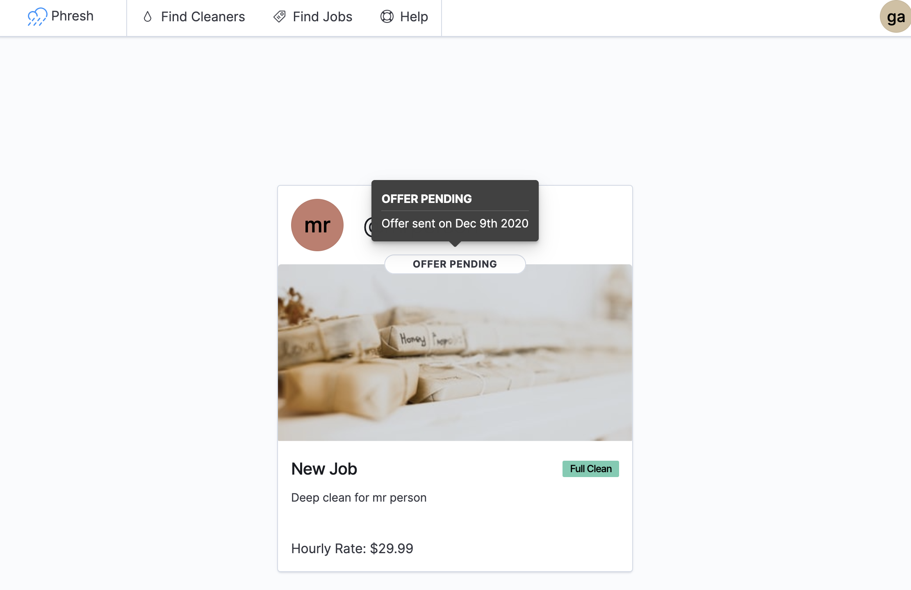

import { CodesandboxDisplay, FastAPISeriesList } from "src/components"

Welcome to Part 19 of Up and Running with FastAPI. If you missed part 18, you can find it [here](/blog/edit-user-owned-cleaning-resources-with-react-and-fastapi).

This series is focused on building a full-stack application with the FastAPI framework. The app allows users to post requests to have their residence cleaned, and other users can select a cleaning project for a given hourly rate.

<FastAPISeriesList upTo={19} />

In the last post we worked our way through implementing a user interface that gave owners of cleaning resources the ability to edit the name, description, price, and type of their cleaning job. We also added a wrapper component to protect against unauthorized access to particular routes on our frontend.

We've spent the entirety of this post in our frontend repo, adding more routing and edit functionality. The addition of the `PermissionsNeeded` component also provides us with a way to prevent unauthorized users from accessing resources they're not allowed to.

This time around we're going to make sure that other users can offer their services for any cleaning job that appeals to them. We'll also want to provide a mechanism for the owners to view and accept any offers for their job.

## Letting Users Offer Their Services For A Job

If we navigate to the `/cleaning-jobs/` page and create a new job, we're redirected to our new job's page with all its info displayed on a card. In the bottom right corner of that card is an "Offer Services" button. Unfortunately, it doesn't do anything at the moment. We're going to change that.

It also doesn't make sense for the cleaning job's owner to see that button, so we'll also want to display something else there as well.

This time we're going to start with the `redux` side of things. We'll be writing a lot of naive code and then refactoring it as we go.

Step one will be setting up our new slice of state to handle `offers`.

## The Offers Redux Slice

Let's start by adding our new offers slice to the `redux/initialState.js` file.

```jsx:title=<span>redux/initialState.js</span>
export default {
  auth: {
    isLoading: false,
    isUpdating: false,
    isAuthenticated: false,
    error: false,
    user: {}
  },
  cleanings: {
    isLoading: false,
    isUpdating: false,
    error: null,
    data: {},
    currentCleaningJob: null
  },
  // highlight-start
  offers: {
    isLoading: false,
    isUpdating: false,
    error: null,
    data: {}
  }
  // highlight-end
}

```

We've been through this before, so it should be familiar. Next create a new file called `offers.js` in the `redux` directory.

```bash
touch src/redux/offers.js
```

And add the following to it:

```jsx:title=<span>redux/offers.js</span>
import initialState from "./initialState"
import apiClient from "../services/apiClient"

export const CREATE_OFFER_FOR_CLEANING_JOB = "@@offers/CREATE_OFFER_FOR_CLEANING_JOB"
export const CREATE_OFFER_FOR_CLEANING_JOB_SUCCESS = "@@offers/CREATE_OFFER_FOR_CLEANING_JOB_SUCCESS"
export const CREATE_OFFER_FOR_CLEANING_JOB_FAILURE = "@@offers/CREATE_OFFER_FOR_CLEANING_JOB_FAILURE"

export default function offersReducer(state = initialState.offers, action = {}) {
  switch (action.type) {
    case CREATE_OFFER_FOR_CLEANING_JOB:
      return {
        ...state,
        isLoading: true
      }
    case CREATE_OFFER_FOR_CLEANING_JOB_SUCCESS:
      return {
        ...state,
        isLoading: false,
        error: null,
        data: {
          ...state.data,
          [action.data.cleaning_id]: {
            ...(state.data[action.data.cleaning_id] || {}),
            [action.data.user_id]: action.data
          }
        }
      }
    case CREATE_OFFER_FOR_CLEANING_JOB_FAILURE:
      return {
        ...state,
        isLoading: false,
        error: action.error
      }
    default:
      return state
  }
}

export const Actions = {}

Actions.createOfferForCleaning = ({ cleaning_id }) => {
  return apiClient({
    url: `/cleanings/${cleaning_id}/offers/`,
    method: `POST`,
    types: {
      REQUEST: CREATE_OFFER_FOR_CLEANING_JOB,
      SUCCESS: CREATE_OFFER_FOR_CLEANING_JOB_SUCCESS,
      FAILURE: CREATE_OFFER_FOR_CLEANING_JOB_FAILURE
    },
    options: {
      data: {},
      params: {}
    }
  })
}

```

As always, we define our action type constants at the top of the file. Each one determines how our `offers` slice should be updated at each stage of the offer creation process.

Below that, we define our `offersReducer` function that is responsible for creating the new state object for each action type. The `CREATE_OFFER_FOR_CLEANING_JOB_SUCCESS` action has the bulk of our update logic at the moment, and that's due to how we are storing offers returned from our FastAPI backend. 

Remember that offers don't have an `id` in our database. Instead, we uniquely identify them by the `user_id` and `cleaning_id` attributes. We are storing each action in a nested hierarchy - first indexing them by `cleaning_id`, and then by `user_id`. This will make accessing all the offers for a single cleaning job much easier.

At the bottom of our file we export our `Actions` object containing the `createOfferForCleaning` action creator function that will actually execute the HTTP `POST` request to our server.

This is looking pretty good, so let's go ahead and add the offers slice to our `redux` state tree.

```jsx:title=<span>redux/rootReducer.js</span>
import { combineReducers } from "redux"

import authReducer from "./auth"
import cleaningsReducer from "./cleanings"
import offersReducer from "./offers"

const rootReducer = combineReducers({
  auth: authReducer,
  cleanings: cleaningsReducer,
  offers: offersReducer
})

export default rootReducer

```

And there we go. Now onto to our component.

## Allows Users to Create An Offer

We're going to start by mapping the appropriate action creator functions and `redux` state to the props of our `CleaningJobView` component. Then we'll do a bit of prop drilling and pass the necessary data down to our `CleaningJobCard` component.

Open up the `CleaningJobView` component and make the following changes:

```jsx:title=<span>CleaningJobView.js</span>
import React from "react"
import { Routes, Route, useNavigate } from "react-router-dom"
import { connect } from "react-redux"
import { Actions as cleaningActions } from "../../redux/cleanings"
import { Actions as offersActions } from "../../redux/offers" // highlight-line
import {
  EuiAvatar,
  EuiButtonEmpty,
  EuiButtonIcon,
  EuiFlexGroup,
  EuiFlexItem,
  EuiPage,
  EuiPageBody,
  EuiPageContent,
  EuiPageContentBody,
  EuiLoadingSpinner,
  EuiTitle
} from "@elastic/eui"
import {
  CleaningJobCard,
  CleaningJobEditForm,
  NotFoundPage,
  PermissionsNeeded
} from "../../components"
import { useParams } from "react-router-dom"
import styled from "styled-components"

const StyledEuiPage = styled(EuiPage)`
  flex: 1;
`
const StyledFlexGroup = styled(EuiFlexGroup)`
  padding: 1rem;
`

function CleaningJobView({
  user,
  isLoading,
  offersError, // highlight-line
  cleaningError,
  offersIsLoading,  // highlight-line
  currentCleaningJob,
  fetchCleaningJobById,
  createOfferForCleaning,  // highlight-line
  clearCurrentCleaningJob
}) {
  const { cleaning_id } = useParams()
  const navigate = useNavigate()

  React.useEffect(() => {
    if (cleaning_id) {
      fetchCleaningJobById({ cleaning_id })
    }

    return () => clearCurrentCleaningJob()
  }, [cleaning_id, fetchCleaningJobById, clearCurrentCleaningJob])

  if (isLoading) return <EuiLoadingSpinner size="xl" />
  if (!currentCleaningJob) return <EuiLoadingSpinner size="xl" />
  if (!currentCleaningJob?.name) return <NotFoundPage />

  const userOwnsCleaningResource = currentCleaningJob?.owner?.id === user?.id

  const editJobButton = userOwnsCleaningResource ? (
    <EuiButtonIcon iconType="documentEdit" aria-label="edit" onClick={() => navigate(`edit`)} />
  ) : null
  const goBackButton = (
    <EuiButtonEmpty
      iconType="sortLeft"
      size="s"
      onClick={() => navigate(`/cleaning-jobs/${currentCleaningJob.id}`)}
    >
      back to job
    </EuiButtonEmpty>
  )
  
  // highlight-start
  const viewCleaningJobElement = (
    <CleaningJobCard
      user={user}
      offersError={offersError}
      cleaningJob={currentCleaningJob}      
      offersIsLoading={offersIsLoading}
      isOwner={userOwnsCleaningResource}
      createOfferForCleaning={createOfferForCleaning}
    />
  )
  // highlight-end
  const editCleaningJobElement = (
    <PermissionsNeeded
      element={<CleaningJobEditForm cleaningJob={currentCleaningJob} />}
      isAllowed={userOwnsCleaningResource}
    />
  )

  return (
    <StyledEuiPage>
      <EuiPageBody component="section">
        <EuiPageContent verticalPosition="center" horizontalPosition="center" paddingSize="none">
          <StyledFlexGroup alignItems="center" direction="row" responsive={false}>
            <EuiFlexItem>
              <EuiFlexGroup
                justifyContent="flexStart"
                alignItems="center"
                direction="row"
                responsive={false}
              >
                <EuiFlexItem grow={false}>
                  <EuiAvatar
                    size="xl"
                    name={
                      currentCleaningJob.owner?.profile?.full_name ||
                      currentCleaningJob.owner?.username ||
                      "Anonymous"
                    }
                    initialsLength={2}
                    imageUrl={currentCleaningJob.owner?.profile?.image}
                  />
                </EuiFlexItem>
                <EuiFlexItem>
                  <EuiTitle>
                    <p>@{currentCleaningJob.owner?.username}</p>
                  </EuiTitle>
                </EuiFlexItem>
              </EuiFlexGroup>
            </EuiFlexItem>
            <EuiFlexItem grow={false}>
              <Routes>
                <Route path="/" element={editJobButton} />
                <Route path="/edit" element={goBackButton} />
              </Routes>
            </EuiFlexItem>
          </StyledFlexGroup>

          <EuiPageContentBody>
            <Routes>
              <Route path="/" element={viewCleaningJobElement} />  // highlight-line
              <Route path="/edit" element={editCleaningJobElement} />
              <Route path="*" element={<NotFoundPage />} />
            </Routes>
          </EuiPageContentBody>
        </EuiPageContent>
      </EuiPageBody>
    </StyledEuiPage>
  )
}

export default connect(
  (state) => ({
    user: state.auth.user,
    isLoading: state.cleanings.isLoading,
    offersIsLoading: state.offers.isLoading,  // highlight-line
    offersError: state.offers.error,  // highlight-line
    cleaningError: state.cleanings.cleaningsError,
    currentCleaningJob: state.cleanings.currentCleaningJob,
  }),
  {
    fetchCleaningJobById: cleaningActions.fetchCleaningJobById,
    clearCurrentCleaningJob: cleaningActions.clearCurrentCleaningJob,
    createOfferForCleaning: offersActions.createOfferForCleaning,  // highlight-line
  }
)(CleaningJobView)

```

With our `offers` redux slice taken care, we import the `Actions` object from it and pass our `createOfferForCleaning` action creator function to the `CleaningJobView` component. We also provide it with the `offersIsLoading` and `offersError` props from `redux` state as well.

Since we're passing a few more props to the `CleaningJobCard` component, we've extracted it into a `viewCleaningJobElement` variable for readibility.

Let's go ahead and open up the `CleaningJobCard` component and take advantage of all the props it's now getting.

```jsx:title=<span>CleaningJobCard.js</span>
import React from "react"
import {
  EuiBadge,
  EuiButton,
  EuiCard,
  EuiFlexGroup,
  EuiFlexItem,
  EuiText,
  EuiSpacer,
  EuiLoadingChart
} from "@elastic/eui"
import styled from "styled-components"

const ImageHolder = styled.div`
  min-width: 400px;
  min-height: 200px;

  & > img {
    position: relative;
    z-index: 2;
  }
`

const cleaningTypeToDisplayNameMapping = {
  dust_up: "Dust Up",
  spot_clean: "Spot Clean",
  full_clean: "Full Clean"
}

export default function CleaningJobCard({
  user,  // highlight-line
  isOwner,  // highlight-line
  offersError,  // highlight-line
  cleaningJob,  // highlight-line
  offersIsLoading,  // highlight-line
  createOfferForCleaning  // highlight-line
}) {
  const image = (
    <ImageHolder>
      <EuiLoadingChart size="xl" style={{ position: "absolute", zIndex: 1 }} />
      
    </ImageHolder>
  )

  const title = (
    <EuiFlexGroup justifyContent="spaceBetween" alignItems="center">
      <EuiFlexItem grow={false}>{cleaningJob.name}</EuiFlexItem>
      <EuiFlexItem grow={false}>
        <EuiBadge color="secondary">
          {cleaningTypeToDisplayNameMapping[cleaningJob.cleaning_type]}
        </EuiBadge>
      </EuiFlexItem>
    </EuiFlexGroup>
  )

  const footer = (
    <>
      <EuiSpacer />
      <EuiFlexGroup justifyContent="spaceBetween" alignItems="flexEnd">
        <EuiFlexItem grow={false}>
          <EuiText>Hourly Rate: ${cleaningJob.price}</EuiText>
        </EuiFlexItem>
        <EuiFlexItem grow={false}>
          // highlight-start
          {isOwner ? null : (
            <EuiButton
              onClick={() => createOfferForCleaning({ cleaning_id: cleaningJob.id })}
              isLoading={offersIsLoading}
            >
              Offer Services
            </EuiButton>
          )}
          // highlight-end
        </EuiFlexItem>
      </EuiFlexGroup>
    </>
  )

  return (
    <EuiCard
      display="plain"
      textAlign="left"
      image={image}
      title={title}
      description={cleaningJob.description}
      footer={footer}
    />
  )
}

```

And there's not much else to it! We destructure our props object and use the `isOwner` prop to determine whether or not to show our `"Offer Services"` button. We've added an `onClick` handler that now calls our `createOfferForCleaning` function and an `isLoading` flag to show a spinner in the button when the user makes that request. We'll handle displaying errors a bit later on.

Go ahead and try it out. Log in with multiple accounts: create a cleaning job with one and create an offer with another. It works!

<CodesandboxDisplay
  codesandboxLink={"https://codesandbox.io/s/phresh-frontend-part-7-creating-and-viewing-job-offers-v56rq?file=/src/components/CleaningJobCard/CleaningJobCard.js"}
  codesandboxProps={{
    src: "https://codesandbox.io/embed/phresh-frontend-part-7-creating-and-viewing-job-offers-v56rq?fontsize=14&hidenavigation=1&theme=dark",
    style: "width:100%; height:500px; border:0; border-radius: 4px; overflow:hidden;",
    title: "phresh-frontend-part-7-creating-job-offers",
    allow: "accelerometer; camera; encrypted-media; geolocation; gyroscope; microphone; midi; payment; usb; xr-spatial-tracking",
    sandbox: "allow-forms allow-modals allow-popups allow-presentation allow-same-origin allow-scripts",
  }}
></CodesandboxDisplay>

If we look at in our terminal or in our `redux` devtools, we should see that the request returned a `201` status code and our offer has been made for the cleaning resource in question. Our redux state tree is also now storing that offer in its `data` attribute. However, there's no visual feedback for the user that the request was successful, and we're still able to make subsequent requests that return a `400` status code indicating multiple offers for the same cleaning job have been attempted.

We'll want to fix that.

There are a couple ways to do this and we're going to take a simple one at first.

Head back into the `redux/offers.js` file and add some new code:

```jsx:title=<span>redux/offers.js</span>
import initialState from "./initialState"
import apiClient from "../services/apiClient"

export const CREATE_OFFER_FOR_CLEANING_JOB = "@@offers/CREATE_OFFER_FOR_CLEANING_JOB"
export const CREATE_OFFER_FOR_CLEANING_JOB_SUCCESS =
  "@@offers/CREATE_OFFER_FOR_CLEANING_JOB_SUCCESS"
export const CREATE_OFFER_FOR_CLEANING_JOB_FAILURE =
  "@@offers/CREATE_OFFER_FOR_CLEANING_JOB_FAILURE"

// highlight-start
export const FETCH_USER_OFFER_FOR_CLEANING_JOB = "@@offers/FETCH_USER_OFFER_FOR_CLEANING_JOB"
export const FETCH_USER_OFFER_FOR_CLEANING_JOB_SUCCESS =
  "@@offers/FETCH_USER_OFFER_FOR_CLEANING_JOB_SUCCESS"
export const FETCH_USER_OFFER_FOR_CLEANING_JOB_FAILURE =
  "@@offers/FETCH_USER_OFFER_FOR_CLEANING_JOB_FAILURE"
// highlight-end

export default function offersReducer(state = initialState.offers, action = {}) {
  switch (action.type) {
    case CREATE_OFFER_FOR_CLEANING_JOB:
      return {
        ...state,
        isLoading: true
      }
    case CREATE_OFFER_FOR_CLEANING_JOB_SUCCESS:
      return {
        ...state,
        isLoading: false,
        error: null,
        data: {
          ...state.data,
          [action.data.cleaning_id]: {
            ...(state.data[action.data.cleaning_id] || {}),
            [action.data.user_id]: action.data
          }
        }
      }
    case CREATE_OFFER_FOR_CLEANING_JOB_FAILURE:
      return {
        ...state,
        isLoading: false,
        error: action.error
      }
    // highlight-start
    case FETCH_USER_OFFER_FOR_CLEANING_JOB:
      return {
        ...state,
        isLoading: true
      }
    case FETCH_USER_OFFER_FOR_CLEANING_JOB_SUCCESS:
      return {
        ...state,
        isLoading: false,
        error: null,
        data: {
          ...state.data,
          [action.data.cleaning_id]: {
            ...(state.data[action.data.cleaning_id] || {}),
            [action.data.user_id]: action.data
          }
        }
      }
    case FETCH_USER_OFFER_FOR_CLEANING_JOB_FAILURE:
      return {
        ...state,
        isLoading: false
        // we don't really mind if this 404s
        // error: action.error,
      }
    // highlight-end
    default:
      return state
  }
}

export const Actions = {}

Actions.createOfferForCleaning = ({ cleaning_id }) => {
  return apiClient({
    url: `/cleanings/${cleaning_id}/offers/`,
    method: `POST`,
    types: {
      REQUEST: CREATE_OFFER_FOR_CLEANING_JOB,
      SUCCESS: CREATE_OFFER_FOR_CLEANING_JOB_SUCCESS,
      FAILURE: CREATE_OFFER_FOR_CLEANING_JOB_FAILURE
    },
    options: {
      data: {},
      params: {}
    }
  })
}

// highlight-start
Actions.fetchUserOfferForCleaningJob = ({ cleaning_id, username }) => {
  return apiClient({
    url: `/cleanings/${cleaning_id}/offers/${username}/`,
    method: `GET`,
    types: {
      REQUEST: FETCH_USER_OFFER_FOR_CLEANING_JOB,
      SUCCESS: FETCH_USER_OFFER_FOR_CLEANING_JOB_SUCCESS,
      FAILURE: FETCH_USER_OFFER_FOR_CLEANING_JOB_FAILURE
    },
    options: {
      data: {},
      params: {}
    }
  })
}
// highlight-end

```

Just like we did before, we define three new action types, update our state tree in our `offersReducer` for each type, and define an action creator function responsible for making an HTTP request to our FastAPI backend.

We're taking a look at the whole file here for a particular reason: a code smell should jump out at us. Our reducer function updates state in exactly the same way for both `CREATE_OFFER_FOR_CLEANING_JOB_SUCCESS` and for `FETCH_USER_OFFER_FOR_CLEANING_JOB_SUCCESS`. Let's go ahead and extract some of that logic out into a function to prevent some of this code duplication.

```jsx:title=<span>redux/offers.js</span>
import initialState from "./initialState"
import apiClient from "../services/apiClient"

export const CREATE_OFFER_FOR_CLEANING_JOB = "@@offers/CREATE_OFFER_FOR_CLEANING_JOB"
export const CREATE_OFFER_FOR_CLEANING_JOB_SUCCESS =
  "@@offers/CREATE_OFFER_FOR_CLEANING_JOB_SUCCESS"
export const CREATE_OFFER_FOR_CLEANING_JOB_FAILURE =
  "@@offers/CREATE_OFFER_FOR_CLEANING_JOB_FAILURE"

export const FETCH_USER_OFFER_FOR_CLEANING_JOB = "@@offers/FETCH_USER_OFFER_FOR_CLEANING_JOB"
export const FETCH_USER_OFFER_FOR_CLEANING_JOB_SUCCESS =
  "@@offers/FETCH_USER_OFFER_FOR_CLEANING_JOB_SUCCESS"
export const FETCH_USER_OFFER_FOR_CLEANING_JOB_FAILURE =
  "@@offers/FETCH_USER_OFFER_FOR_CLEANING_JOB_FAILURE"

// highlight-start
function updateStateWithOfferForCleaning(state, offer) {
  return {
    ...state,
    isLoading: false,
    error: null,
    data: {
      ...state.data,
      [offer.cleaning_id]: {
        ...(state.data[offer.cleaning_id] || {}),
        [offer.user_id]: offer
      }
    }
  }
}
// highlight-end

export default function offersReducer(state = initialState.offers, action = {}) {
  switch (action.type) {
    case CREATE_OFFER_FOR_CLEANING_JOB:
      return {
        ...state,
        isLoading: true
      }
    case CREATE_OFFER_FOR_CLEANING_JOB_SUCCESS:
      return updateStateWithOfferForCleaning(state, action.data)  // highlight-line
    case CREATE_OFFER_FOR_CLEANING_JOB_FAILURE:
      return {
        ...state,
        isLoading: false,
        error: action.error
      }
    case FETCH_USER_OFFER_FOR_CLEANING_JOB:
      return {
        ...state,
        isLoading: true
      }
    case FETCH_USER_OFFER_FOR_CLEANING_JOB_SUCCESS:
      return updateStateWithOfferForCleaning(state, action.data)  // highlight-line
    case FETCH_USER_OFFER_FOR_CLEANING_JOB_FAILURE:
      return {
        ...state,
        isLoading: false
        // we don't really mind if this 404s
        // error: action.error,
      }
    default:
      return state
  }
}

export const Actions = {}

Actions.createOfferForCleaning = ({ cleaning_id }) => {
  return apiClient({
    url: `/cleanings/${cleaning_id}/offers/`,
    method: `POST`,
    types: {
      REQUEST: CREATE_OFFER_FOR_CLEANING_JOB,
      SUCCESS: CREATE_OFFER_FOR_CLEANING_JOB_SUCCESS,
      FAILURE: CREATE_OFFER_FOR_CLEANING_JOB_FAILURE
    },
    options: {
      data: {},
      params: {}
    }
  })
}

Actions.fetchUserOfferForCleaningJob = ({ cleaning_id, username }) => {
  return apiClient({
    url: `/cleanings/${cleaning_id}/offers/${username}/`,
    method: `GET`,
    types: {
      REQUEST: FETCH_USER_OFFER_FOR_CLEANING_JOB,
      SUCCESS: FETCH_USER_OFFER_FOR_CLEANING_JOB_SUCCESS,
      FAILURE: FETCH_USER_OFFER_FOR_CLEANING_JOB_FAILURE
    },
    options: {
      data: {},
      params: {}
    }
  })
}

```

Much nicer. Our new `updateStateWithOfferForCleaning` function now takes in the current state and an offer object sent from our server, and provides us with a fresh state object. The offer is incorporated into the `data` attribute in exactly the same way as before, though we've renamed `action.data` as `offer` to be more explicit.

We can then leverage our new function inside our `offersReducer`, thereby reducing code duplication. Lovely.

Let's head back to our `CleaningJobView` component.


```jsx:title=<span>CleaningJobView.js</span>
// ...other code

function CleaningJobView({
  user,
  isLoading,
  offersError,
  cleaningError,
  offersIsLoading,
  currentCleaningJob,
  fetchCleaningJobById,
  createOfferForCleaning,
  clearCurrentCleaningJob,
  fetchUserOfferForCleaningJob, // highlight-line
}) {
  const { cleaning_id } = useParams()
  const navigate = useNavigate()

  // highlight-start
  const userOwnsCleaningResource = user?.username && currentCleaningJob?.owner?.id === user?.id

  React.useEffect(() => {
    if (cleaning_id && user?.username) {
      fetchCleaningJobById({ cleaning_id })
      
      if (!userOwnsCleaningResource) {
        fetchUserOfferForCleaningJob({ cleaning_id, username: user.username })
      }
    }

    return () => clearCurrentCleaningJob()
  }, [
    cleaning_id,
    fetchCleaningJobById,
    clearCurrentCleaningJob,
    userOwnsCleaningResource,
    fetchUserOfferForCleaningJob,
    user,
  ])
  // highlight-end

  // ...other code
}

export default connect(
  (state) => ({
    user: state.auth.user,
    isLoading: state.cleanings.isLoading,
    offersIsLoading: state.offers.isLoading,
    offersError: state.offers.error,
    cleaningError: state.cleanings.cleaningsError,
    currentCleaningJob: state.cleanings.currentCleaningJob
  }),
  {
    fetchCleaningJobById: cleaningActions.fetchCleaningJobById,
    clearCurrentCleaningJob: cleaningActions.clearCurrentCleaningJob,
    fetchUserOfferForCleaningJob: offersActions.fetchUserOfferForCleaningJob,  // highlight-line
    createOfferForCleaning: offersActions.createOfferForCleaning
  }
)(CleaningJobView)

```

This component is continuing to grow in size, so we've shown an abbreviated version here.

We take our newly created `fetchUserOfferForCleaningJob` function and map it to the props of our `CleaningJobView` component. Next we do a bit of restructuring to our `React.useEffect` hook. 

First we move the `userOwnsCleaningResource` flag to the top of the component, as we'll be using it in our `useEffect` hook. We also add the appropriate conditional chaining safeguards and ensure that the `user` exists and has a `username` attribute before declaring that the user owns the current cleaning job.

If the authenticated user **doesn't** own the job, we fetch any offer they may have made using the `cleaning_id` of the job and the user's `username`.

Let's now make sure that we update the UI accordingly in the `CleaningJobCard` component.

```jsx:title=<span>CleaningJobCard.js</span>
import React from "react"
import moment from "moment" // highlight-line
import { useSelector } from "react-redux"  // highlight-line

// ...other code

export default function CleaningJobCard({
  user,
  isOwner,
  offersError,
  cleaningJob,
  offersIsLoading,
  createOfferForCleaning
}) {
  // highlight-start
  const userOfferForCleaningJob = useSelector(
    (state) => state.offers.data?.[cleaningJob?.id]?.[user?.id]
  )
  // highlight-end

  // ...other code

  const footer = (
    <>
      <EuiSpacer />
      <EuiFlexGroup justifyContent="spaceBetween" alignItems="flexEnd">
        <EuiFlexItem grow={false}>
          <EuiText>Hourly Rate: ${cleaningJob.price}</EuiText>
        </EuiFlexItem>
        <EuiFlexItem grow={false}>
          // highlight-start
          {isOwner || userOfferForCleaningJob ? null : (
            <EuiButton
              onClick={() => createOfferForCleaning({ cleaning_id: cleaningJob.id })}
              isLoading={offersIsLoading}
            >
              Offer Services
            </EuiButton>
          )}
          // highlight-end
        </EuiFlexItem>
      </EuiFlexGroup>
    </>
  )  

  // highlight-start
  const betaBadgeLabel = userOfferForCleaningJob
    ? `Offer ${userOfferForCleaningJob.status}`.toUpperCase()
    : null
  const betaBadgeTooltipContent = userOfferForCleaningJob
    ? `Offer sent on ${moment(new Date(userOfferForCleaningJob.created_at)).format("MMM Do YYYY")}`
    : null
  // highlight-end

  return (
    <EuiCard
      display="plain"
      textAlign="left"
      image={image}
      title={title}
      betaBadgeLabel={betaBadgeLabel}  // highlight-line
      betaBadgeTooltipContent={betaBadgeTooltipContent}  // highlight-line
      description={cleaningJob.description}
      footer={footer}
    />
  )
}

```

Now here's something new!

Since v7.1.0, `react-redux` offers the `useSelector` hook as part of its core API. This new approach aligns nicely with React's move to hooks and offers an alternative to wrapping components with the `connect` higher order function. Instead, we pass a function to the `useSelector` hook that selects a piece of state to be used in our component. 

Though these two methods work in the same way, there's one fundamental difference to be aware of. As the `react-redux` [docs](https://react-redux.js.org/api/hooks#useselector) indicate:

> `useSelector()` uses strict `===` reference equality checks by default, not shallow equality

As a primary consequence, any previous and future value that doesn't pass a `previous_value === future_value` check will force the component to rerender. In our case, that may eventually cause problems. Let's see why.

Our selector code appears as such:

```jsx
const userOfferForCleaningJob = useSelector(
  (state) => state.offers.data?.[cleaningJob?.id]?.[user?.id]
)
```

We use the `id` of the cleaning job and user to access an `offer` object potentially stored in `redux` state. It would make sense for our component to rerender when that offer is returned from our server. However, our current setup would also force a rerender any time that object is copied and a new `offers` slice is created. 

Why? Because in JavaScript, executing a strict reference equality check between two objects with the same properties returns `false`. Try it out in the console.

```jsx
{} === {} // false
{ a: 1 } === { a: 1 } // false
```

Both of these objects are stored at a different location in memory and therefore don't pass a strict reference equality check. For us, it means that anytime the reference to our offers object changes, our component will rerender. That's sub-optimal.

Fortunately, there's an easy fix for it! There's actually more than one, so we'll show two of them here. We can either have our `useSelector` hook only return values that would pass a `===` test, or use the `shallowEqual` function that comes with `react-redux` as our `equalityFn` in `useSelector`.

Let's look at each approach.

Since we're currently only using the `status` and `created_at` attributes on our offer object, a naive but effective method would look like this:

```jsx
const userOfferForCleaningJobStatus = useSelector(
  (state) => state.offers.data?.[cleaningJob?.id]?.[user?.id]?.status
)
const userOfferForCleaningJobCreatedAt = useSelector(
  (state) => state.offers.data?.[cleaningJob?.id]?.[user?.id]?.created_at
)
```

Now we have access to both of the desired attributes, each of which would pass a `===` test. As long as we don't require access to any other attributes, this is easy enough. Using multiple `useSelector` hooks is totally fine! It just requires more code and can get silly if we need 5 or more instances just to access attributes on an object.

The method we'll be using looks like this:

```jsx
import { useSelector, shallowEqual } from "react-redux"

const userOfferForCleaningJob = useSelector(
  (state) => state.offers.data?.[cleaningJob?.id]?.[user?.id],
  shallowEqual
)
```

The second argument to `useSelector` accepts an equality function and we go ahead and pass in the `shallowEqual` function from `react-redux`. And that's it. Nothing else is needed. We've now prevented unnecessary rerenders and leveraged the new hooks API of `react-redux`.

We could also use a `memoized` selector from `reselect`, but that's probably not needed unless we were using quite a bit of derived state.

A small refactor to our component gives us:

```jsx:title=<span>CleaningJobCard.js</span>
import React from "react"
import moment from "moment"
import { useSelector, shallowEqual } from "react-redux"  // highlight-line

// ...other code

export default function CleaningJobCard({
  user,
  isOwner,
  offersError,
  cleaningJob,
  offersIsLoading,
  createOfferForCleaning
}) {
  // highlight-start
  const userOfferForCleaningJob = useSelector(
    (state) => state.offers.data?.[cleaningJob?.id]?.[user?.id],
    shallowEqual
  )
  // highlight-end

  // ...other code

  const betaBadgeLabel = userOfferForCleaningJob
    ? `Offer ${userOfferForCleaningJob.status}`.toUpperCase()
    : null
  const betaBadgeTooltipContent = userOfferForCleaningJob
    ? `Offer sent on ${moment(new Date(userOfferForCleaningJob.created_at)).format("MMM Do YYYY")}`
    : null

  return (
    <EuiCard
      display="plain"
      textAlign="left"
      image={image}
      title={title}
      betaBadgeLabel={betaBadgeLabel}
      betaBadgeTooltipContent={betaBadgeTooltipContent}
      description={cleaningJob.description}
      footer={footer}
    />
  )
}

```

Though we didn't mention it before, we've also added content to our `EuiCard` component for the `betaBadgeLabel` and `betaBadgeTooltipContent` props. This shows a badge at the top of the card image with the current offer's status and when it was created. We also remove the `Offer Services` button in case the use has already done so.



It would probably be wise to refactor our code to take advantage of `useSelector` in a number of places, but we'll leave that for a later post.

Now it's time to see our work in action. Navigate to any cleaning job page that the authenticated user doesn't own, and click on "Offer Services". If everything works as it's supposed to, we should see something similar to the image shown above.

<CodesandboxDisplay
  codesandboxLink={"https://codesandbox.io/s/phresh-frontend-part-7-creating-job-offers-forked-mdegi?file=/src/components/CleaningJobCard/CleaningJobCard.js"}
  codesandboxProps={{
    src: "https://codesandbox.io/embed/phresh-frontend-part-7-fetching-user-offer-for-cleaning-job-mdegi?fontsize=14&hidenavigation=1&theme=dark",
    style: "width:100%; height:500px; border:0; border-radius: 4px; overflow:hidden;",
    title: "phresh-frontend-part-7-fetching-user-offer-for-cleaning-job",
    allow: "accelerometer; camera; encrypted-media; geolocation; gyroscope; microphone; midi; payment; usb; xr-spatial-tracking",
    sandbox: "allow-forms allow-modals allow-popups allow-presentation allow-same-origin allow-scripts",
  }}
></CodesandboxDisplay>

Fantastic.

## Wrapping Up and Resources

And there we have it. With users finally able to create offers for cleaning jobs, we're now supporting the beginnings of marketplace behavior in our UI. We still need to give job owners the ability to accept and reject offers, as well as provide a smoother interface for finding relevant jobs.

+ Elastic UI Card [docs](https://elastic.github.io/eui/#/display/card)
+ React Redux Hooks [docs](https://react-redux.js.org/api/hooks)
+ MDN Equality and Sameness [docs](https://developer.mozilla.org/en-US/docs/Web/JavaScript/Equality_comparisons_and_sameness)
+ MDN Comparing Objects [docs](https://developer.mozilla.org/en-US/docs/Web/JavaScript/Guide/Working_with_Objects#Comparing_objects)
+ Clear StackOverflow Strict Equality Check [answer](https://stackoverflow.com/questions/58212159/strict-equality-versus-shallow-equality-checks-in-react-redux)
+ Reselect [library](https://github.com/reduxjs/reselect)


